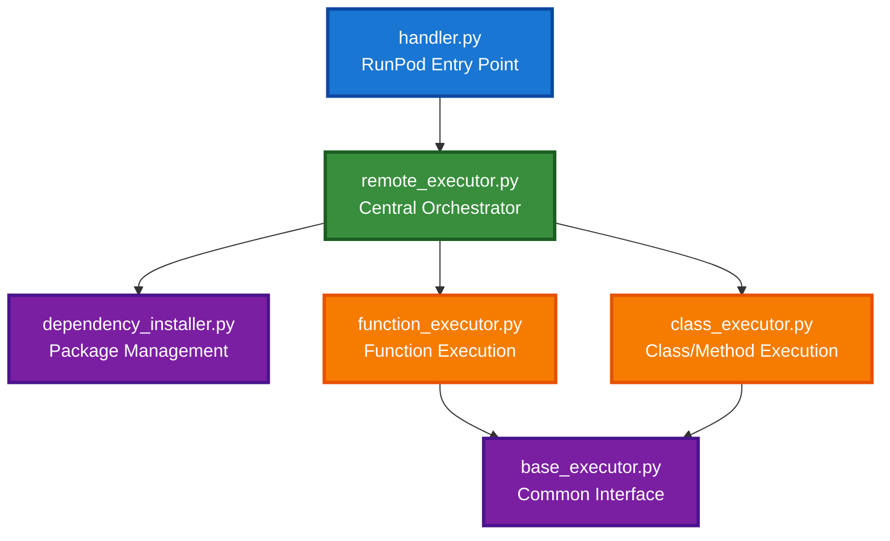
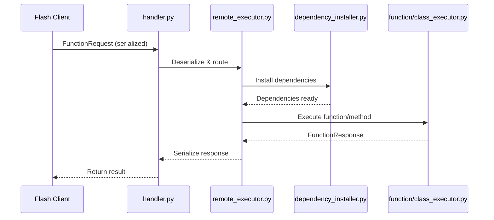
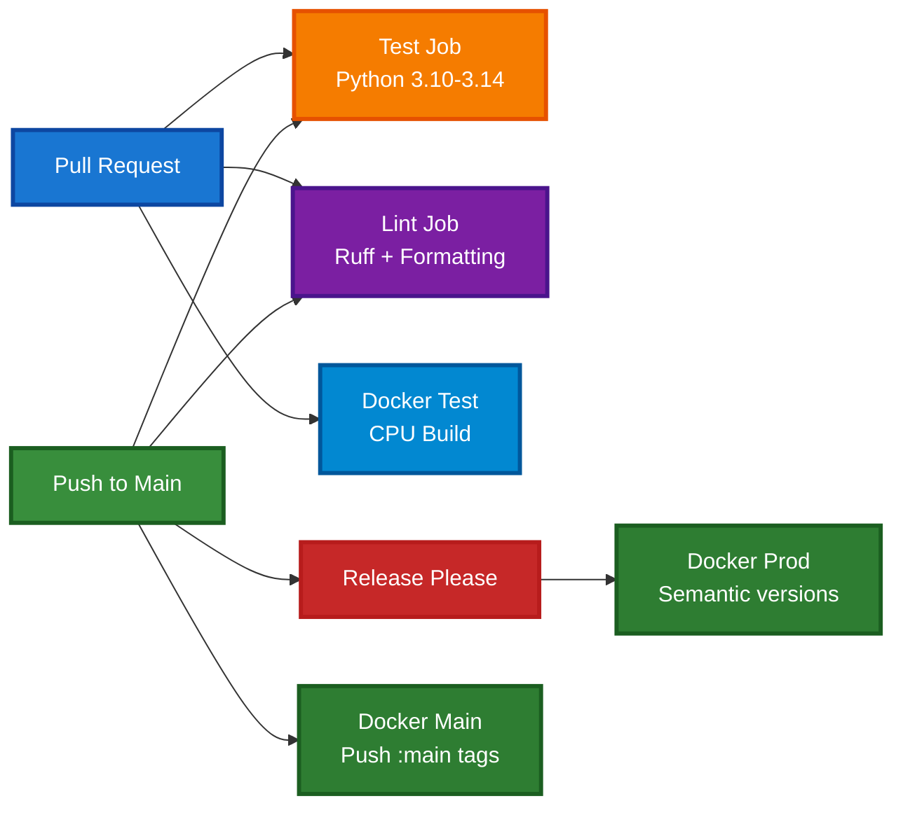

# DEVELOPMENT

Developer guide for contributing to worker-flash, a RunPod Serverless worker for remote Python execution.

## Table of Contents

- [Getting Started](#getting-started)
- [Development Workflow](#development-workflow)
- [Testing Strategy](#testing-strategy)
- [Code Quality & Standards](#code-quality--standards)
- [Architecture Overview](#architecture-overview)
- [Common Development Tasks](#common-development-tasks)
- [Docker Development](#docker-development)
- [runpod-flash Dependency Management](#runpod-flash-dependency-management)
- [CI/CD Pipeline](#cicd-pipeline)
- [Contributing Guidelines](#contributing-guidelines)
- [Debugging Guide](#debugging-guide)
- [Troubleshooting](#troubleshooting)

## Getting Started

### Prerequisites

- Python 3.10+ (3.12 recommended)
- Docker Desktop (for container testing)
- `uv` package manager ([installation](https://github.com/astral-sh/uv))
- Git

### Initial Setup

```bash
# Clone repository
git clone https://github.com/runpod/worker-flash.git
cd worker-flash

# Initialize project (creates venv, syncs deps)
make setup

# Activate virtual environment
source .venv/bin/activate

# Verify setup with tests
make test
```

### Local Development with runpod-flash

For local development on both worker-flash and runpod-flash:

```bash
# Install runpod-flash in editable mode from your local checkout
uv pip install -e ~/Github/python/runpod-flash

# Now your changes to runpod-flash are reflected immediately in worker-flash
make test
```

To switch back to the remote version:

```bash
# Reinstall from remote repository
uv pip install runpod-flash @ git+https://github.com/runpod/runpod-flash.git@main
make test
```

### Environment Variables

Create a `.env` file (gitignored) for local development:

```bash
# Optional - only needed for RunPod integration testing
RUNPOD_API_KEY=your_key_here

# Optional - for HuggingFace private models
HF_TOKEN=your_token_here
```

## Development Workflow

### Standard Development Cycle

1. **Create feature branch**
   ```bash
   git checkout -b feature/TICKET-description
   ```

2. **Write failing tests first** (TDD approach)
   ```bash
   # Add test to tests/unit/test_*.py
   make test-fast  # Should fail
   ```

3. **Implement feature**
   ```bash
   # Edit src/*.py
   make test-fast  # Should pass
   ```

4. **Run quality checks**
   ```bash
   make quality-check  # Format, lint, typecheck, coverage, handler tests
   ```

5. **Commit and push**
   ```bash
   git add .
   git commit -m "feat(component): description"
   git push origin feature/TICKET-description
   ```

### Daily Commands

```bash
# Install/sync dependencies after pulling changes
make dev

# Run tests during development (fail-fast mode)
make test-fast

# Format code before committing
make format

# Check everything before push
make quality-check
```

## Testing Strategy

### Test Organization

```
tests/
├── unit/              # Fast, isolated component tests
│   ├── test_function_executor.py
│   ├── test_class_executor.py
│   ├── test_dependency_installer.py
│   └── ...
├── integration/       # End-to-end workflow tests
│   ├── test_handler_integration.py
│   └── test_remote_execution.py
└── conftest.py       # Shared fixtures
```

### When to Write Each Test Type

**Unit Tests** (`tests/unit/`):
- Testing individual components in isolation
- Mocking external dependencies
- Fast execution (< 100ms per test)
- Example: Testing `FunctionExecutor.execute()` with mock request

**Integration Tests** (`tests/integration/`):
- Testing complete workflows
- Real dependency installation
- Slower execution (seconds)
- Example: End-to-end remote function execution

### Test Structure (AAA Pattern)

```python
def test_feature_behavior():
    # Arrange - Set up test data
    executor = FunctionExecutor()
    request = FunctionRequest(
        function_name="test_func",
        function_code="def test_func(): return 42",
        args=[],
        kwargs={},
    )

    # Act - Execute the operation
    response = executor.execute(request)

    # Assert - Verify expectations
    assert response.success is True
    result = cloudpickle.loads(base64.b64decode(response.result))
    assert result == 42
```

### Testing Async Functions/Methods

```python
def test_execute_async_function():
    """Test async function execution."""
    request = FunctionRequest(
        function_name="async_func",
        function_code="async def async_func(): return 'result'",
        args=[],
        kwargs={},
    )

    response = executor.execute(request)

    assert response.success is True
    # Async functions are executed with asyncio.run() internally
```

### Running Tests

```bash
# Run all tests
make test

# Run only unit tests
make test-unit

# Run only integration tests
make test-integration

# Run with coverage report (HTML in htmlcov/)
make test-coverage

# Run with fail-fast (stop on first failure)
make test-fast

# Run specific test file
uv run pytest tests/unit/test_function_executor.py -xvs

# Run specific test function
uv run pytest tests/unit/test_function_executor.py::TestFunctionExecution::test_execute_simple_function -xvs

# Test handler with JSON test files
make test-handler
```

### Coverage Requirements

- Minimum: 35% total coverage (enforced in CI)
- Target: 80%+ for new code
- Critical paths: 90%+ (executors, serialization)

## Code Quality & Standards

### Formatting

```bash
# Format all code (modifies files)
make format

# Check formatting without changes
make format-check
```

**Rules:**
- PEP 8 compliance via ruff
- Line length: 88 characters
- Single newline at end of files
- No trailing whitespace

### Linting

```bash
# Check for issues
make lint

# Auto-fix fixable issues
make lint-fix
```

**Key Rules:**
- No unused imports
- No undefined variables
- No mutable default arguments
- No bare `except:` clauses

### Type Checking

```bash
# Run mypy type checker
make typecheck
```

**Requirements:**
- Type hints mandatory for all functions
- No `Any` types without justification
- Pydantic models for data validation

Example:
```python
def process_data(items: list[dict[str, Any]]) -> pd.DataFrame:
    """Process items and return DataFrame."""
    pass
```

### Pre-Commit Quality Check

Always run before committing:

```bash
make quality-check
```

This runs:
1. Format check
2. Lint check
3. Type check
4. Test suite with coverage
5. Handler test files

## Architecture Overview

### Component Hierarchy



### Execution Flow



### Key Patterns

**Composition Over Inheritance:**
- `RemoteExecutor` composes `DependencyInstaller` and executors
- Clear separation of concerns

**Async Support:**
- Detects async functions with `inspect.iscoroutinefunction()`
- Executes with `asyncio.run()` for async, direct call for sync
- Supports both in `FunctionExecutor` and `ClassExecutor`

**Serialization:**
- CloudPickle for function arguments and results
- Base64 encoding for transport
- Handles complex Python objects

**Error Handling:**
- Structured responses via `FunctionResponse`
- Full traceback capture
- Combined stdout/stderr/log output

### Detailed Architecture

See [CLAUDE.md](CLAUDE.md) for comprehensive architecture documentation and component details.

## Common Development Tasks

### Adding a New Executor Type

1. **Create executor class**
   ```python
   # src/new_executor.py
   from base_executor import BaseExecutor
   from remote_execution import FunctionRequest, FunctionResponse

   class NewExecutor(BaseExecutor):
       def execute(self, request: FunctionRequest) -> FunctionResponse:
           # Implementation
           pass
   ```

2. **Add to RemoteExecutor**
   ```python
   # src/remote_executor.py
   from new_executor import NewExecutor

   def __init__(self):
       self.new_executor = NewExecutor()

   def execute(self, request: FunctionRequest) -> FunctionResponse:
       if request.execution_type == "new_type":
           return self.new_executor.execute(request)
   ```

3. **Write tests**
   ```python
   # tests/unit/test_new_executor.py
   class TestNewExecutor:
       def test_execute_basic(self):
           # AAA pattern
           pass
   ```

### Adding System Packages

System packages that require `apt-get` installation:

```python
# src/constants.py
LARGE_SYSTEM_PACKAGES = [
    "ffmpeg",
    "libsm6",
    "libxext6",
    "your-package-here",  # Add here
]
```

### Writing Handler Test Files

Handler tests validate end-to-end execution:

```bash
# Create test file
cat > src/tests/test_my_feature.json << 'EOF'
{
  "input": {
    "function_name": "my_function",
    "function_code": "def my_function(x): return x * 2",
    "args": ["Mg=="],  # base64(cloudpickle.dumps(3))
    "kwargs": {},
    "python_dependencies": [],
    "system_dependencies": []
  }
}
EOF

# Test locally
make test-handler
```

### Modifying Dependency Installation

Edit `src/dependency_installer.py`:

```python
def install_python_packages(self, packages: list[str]) -> FunctionResponse:
    # Add custom logic
    # Uses uv pip install with environment detection
    pass

def install_system_packages(self, packages: list[str]) -> FunctionResponse:
    # Add custom logic
    # Uses apt-get/nala with acceleration
    pass
```

### Debugging Remote Execution Failures

1. **Check serialization**
   ```python
   # Test argument encoding
   import cloudpickle, base64
   arg = "test"
   encoded = base64.b64encode(cloudpickle.dumps(arg)).decode()
   decoded = cloudpickle.loads(base64.b64decode(encoded))
   assert arg == decoded
   ```

2. **Review response output**
   ```python
   response = executor.execute(request)
   print(response.stdout)  # Combined stdout/stderr/logs
   print(response.error)   # Error message + traceback
   ```

3. **Test in isolation**
   ```python
   # Run function locally first
   exec(function_code, namespace := {})
   func = namespace[function_name]
   result = func(*args, **kwargs)  # Direct execution
   ```

## Docker Development

### Building Images

```bash
# Build both GPU and CPU images
make build

# Build GPU image only
make build-gpu

# Build CPU image only
make build-cpu

# Build and test on macOS (ARM)
make smoketest-macos-build
make smoketest-macos
```

### Image Details

**GPU Image (`Dockerfile`):**
- Base: `runpod/pytorch:2.8.0-py3.11-cuda12.8.0-devel-ubuntu24.04`
- Platform: `linux/amd64`
- CUDA 12.8 support
- PyTorch 2.8.0 pre-installed

**CPU Image (`Dockerfile-cpu`):**
- Base: `python:3.11-slim`
- Platform: `linux/amd64`
- Minimal footprint

### Testing in Containers

```bash
# Build image
make build-cpu

# Run container interactively
docker run -it --rm \
  -v $(pwd):/workspace \
  -e RUNPOD_TEST_INPUT="$(cat src/tests/test_input.json)" \
  runpod/worker-flash:dev \
  /bin/bash

# Inside container, run handler
cd /workspace
python handler.py
```

### Multi-Architecture Builds

CI builds for multiple platforms:
- GPU: `linux/amd64`
- CPU: `linux/amd64`, `linux/arm64`

## runpod-flash Dependency Management

### Understanding runpod-flash

The `runpod-flash` package is a pip dependency containing the Flash SDK:
- Client library with `@remote` decorator
- Resource management (`LiveServerless`)
- Protocol definitions
- Peer-to-peer cross-endpoint routing

### Default Configuration

By default, worker-flash uses the remote runpod-flash from GitHub:
```
runpod-flash @ git+https://github.com/runpod/runpod-flash.git@main
```

### Local Development Workflow

When making changes to both projects:

```bash
# Clone both repositories
cd ~/Github/python
git clone https://github.com/runpod/runpod-flash.git
git clone https://github.com/runpod/worker-flash.git
cd worker-flash

# Install runpod-flash in editable mode
uv pip install -e ~/Github/python/runpod-flash

# Now edit files in runpod-flash - changes are reflected immediately
cd ~/Github/python/runpod-flash
git checkout -b feature/my-change
# ... make changes ...
make test  # Run runpod-flash tests

# Run worker-flash tests to verify integration
cd ~/Github/python/worker-flash
make test

# Commit changes in runpod-flash first
cd ~/Github/python/runpod-flash
git commit -m "feat: my change"
git push origin feature/my-change
# Create PR and merge

# After runpod-flash PR merges, switch back to remote
cd ~/Github/python/worker-flash
uv pip install runpod-flash @ git+https://github.com/runpod/runpod-flash.git@main
make test
```

### Updating to Latest runpod-flash

```bash
# Update runpod-flash to latest main from remote
uv pip install --upgrade runpod-flash @ git+https://github.com/runpod/runpod-flash.git@main

# Verify compatibility
make test
```

### Benefits of This Approach

- **Independent release cycles**: Both projects can be versioned separately
- **Flexible local development**: Use `-e` flag to test changes immediately
- **Cleaner git history**: No submodule commit noise
- **CI/CD simplification**: Standard pip dependency management

## CI/CD Pipeline

### GitHub Actions Workflows

**Primary Workflow (`.github/workflows/ci.yml`):**



**Test Job:**
- Runs on Python 3.9, 3.10, 3.11, 3.12, 3.13
- Executes `make test-coverage`
- Requires 35% minimum coverage
- Tests handler with all `test_*.json` files

**Lint Job:**
- Python 3.11 only
- Runs `make format-check` and `make lint`

**Docker Jobs:**
- Builds GPU and CPU images
- Pushes `:main` tags on main branch
- Pushes semantic version tags on release

### Release Process

Automated with [release-please](https://github.com/googleapis/release-please):

1. **Make commits with conventional format**
   ```bash
   git commit -m "feat: new feature"
   git commit -m "fix: bug fix"
   git commit -m "refactor: code improvement"
   ```

2. **Release Please creates PR**
   - Auto-generates changelog
   - Bumps version in `pyproject.toml`
   - Updates `CHANGELOG.md`

3. **Merge release PR**
   - Creates GitHub release
   - Tags with semantic version
   - Triggers Docker production builds

4. **Docker images published**
   - `runpod/worker-flash:latest`
   - `runpod/worker-flash:X.Y.Z`
   - `runpod/worker-flash:X.Y`
   - `runpod/worker-flash:X`

### Fixing CI Failures Locally

**Test failures:**
```bash
# Run exact CI test command
make test-coverage

# Check coverage report
open htmlcov/index.html
```

**Lint failures:**
```bash
# Run exact CI lint commands
make format-check
make lint
```

**Docker build failures:**
```bash
# Build locally
make build-cpu

# Test built image
docker run --rm runpod/worker-flash:dev python -c "import handler"
```

## Contributing Guidelines

### Git Workflow

1. **Branch from main**
   ```bash
   git checkout main
   git pull origin main
   git checkout -b feature/TICKET-description
   ```

2. **Branch naming conventions**
   - `feature/TICKET-description` - New features
   - `fix/TICKET-description` - Bug fixes
   - `refactor/description` - Code improvements
   - `perf/description` - Performance improvements
   - `docs/description` - Documentation

3. **Make commits**
   ```bash
   git add .
   git commit -m "type(scope): subject"
   ```

### Commit Message Format

Follow [Conventional Commits](https://www.conventionalcommits.org/):

```
type(scope): subject

Longer description if needed.

- Bullet points for multiple changes
- Reference issue numbers
```

**Types:**
- `feat` - New feature
- `fix` - Bug fix
- `refactor` - Code refactoring (included in release notes)
- `perf` - Performance improvement
- `test` - Adding/updating tests
- `docs` - Documentation only
- `chore` - Maintenance tasks
- `build` - Build system changes

**Scopes:**
- `executor` - Executor components
- `installer` - Dependency installer
- `handler` - Handler entry point
- `serialization` - Serialization utils
- `logging` - Log streaming
- `ci` - CI/CD changes

**Examples:**
```bash
git commit -m "feat(executor): add async function execution support"
git commit -m "fix(installer): handle missing system packages gracefully"
git commit -m "refactor(serialization): simplify cloudpickle encoding"
git commit -m "docs: update DEVELOPMENT.md with testing guide"
```

### Pull Request Checklist

Before opening PR:

- [ ] All tests pass (`make test`)
- [ ] Code formatted (`make format`)
- [ ] No lint errors (`make lint`)
- [ ] Type hints present (`make typecheck`)
- [ ] Coverage meets minimum 35% (`make test-coverage`)
- [ ] Handler tests pass (`make test-handler`)
- [ ] Commits follow conventional format
- [ ] PR description explains changes

**PR Template:**

```markdown
## Summary
Brief description of changes

## Changes
- Change 1
- Change 2

## Testing
How was this tested?

## Related Issues
Fixes #123
```

### Code Review Expectations

**As Author:**
- Respond to feedback within 24 hours
- Keep PRs focused and small
- Update based on review comments
- Ensure CI passes before requesting review

**As Reviewer:**
- Review within 48 hours
- Check for correctness, readability, tests
- Suggest improvements, don't demand perfection
- Approve when requirements met

## Debugging Guide

### Debugging Executor Components

**FunctionExecutor Issues:**

```python
# Enable debug logging
import logging
logging.basicConfig(level=logging.DEBUG)

# Test function execution
from function_executor import FunctionExecutor
from remote_execution import FunctionRequest

executor = FunctionExecutor()
request = FunctionRequest(
    function_name="test",
    function_code="def test(): return 42",
    args=[],
    kwargs={},
)

response = executor.execute(request)
print(f"Success: {response.success}")
print(f"Result: {response.result}")
print(f"Output: {response.stdout}")
print(f"Error: {response.error}")
```

**ClassExecutor Issues:**

```python
# Test class method execution
from class_executor import ClassExecutor

executor = ClassExecutor()
request = FunctionRequest(
    execution_type="class",
    class_name="TestClass",
    class_code="""
class TestClass:
    def __init__(self, value):
        self.value = value
    def get(self):
        return self.value
""",
    method_name="get",
    constructor_args=encoded_args,
    args=[],
    kwargs={},
)

response = executor.execute_class_method(request)
# Check response.instance_id, response.instance_info
```

### Log Streaming and Output Capture

All executor output is captured:

```python
# In your test function
def test_func():
    print("stdout message")  # Captured
    logging.info("log message")  # Captured
    import sys
    sys.stderr.write("stderr message\n")  # Captured
    return "result"

# All output available in response.stdout
response = executor.execute(request)
assert "stdout message" in response.stdout
assert "log message" in response.stdout
assert "stderr message" in response.stdout
```

### Dependency Installation Issues

**Debug Python packages:**

```python
from dependency_installer import DependencyInstaller

installer = DependencyInstaller()
response = installer.install_python_packages(["numpy", "pandas"])

if not response.success:
    print(f"Installation failed: {response.error}")
    print(f"Output: {response.stdout}")
```

**Debug system packages:**

```python
response = installer.install_system_packages(["ffmpeg", "libsm6"])

if not response.success:
    print(f"Installation failed: {response.error}")
    # Check if Docker vs local environment
    # Check package availability with apt-cache
```

### Serialization/Deserialization Failures

**Test serialization:**

```python
import cloudpickle
import base64
from serialization_utils import SerializationUtils

# Test argument serialization
args = [1, 2, 3]
encoded = [base64.b64encode(cloudpickle.dumps(arg)).decode() for arg in args]
decoded = SerializationUtils.deserialize_args(encoded)
assert args == decoded

# Test kwargs serialization
kwargs = {"key": "value"}
encoded = {k: base64.b64encode(cloudpickle.dumps(v)).decode()
           for k, v in kwargs.items()}
decoded = SerializationUtils.deserialize_kwargs(encoded)
assert kwargs == decoded
```

**Handle serialization errors:**

```python
try:
    result = cloudpickle.dumps(complex_object)
except Exception as e:
    # Some objects can't be pickled (file handles, sockets, etc.)
    print(f"Serialization failed: {e}")
    # Simplify the object or use alternative serialization
```

### Async Execution Problems

**Debug async function execution:**

```python
import asyncio
import inspect

async def async_func():
    await asyncio.sleep(0.1)
    return "result"

# Check if function is coroutine
assert inspect.iscoroutinefunction(async_func)

# Execute manually
result = asyncio.run(async_func())
assert result == "result"

# Test through executor
request = FunctionRequest(
    function_name="async_func",
    function_code="async def async_func(): return 'result'",
    args=[],
    kwargs={},
)
response = executor.execute(request)
# Executor handles asyncio.run() internally
```

### Common Error Patterns

**Function not found:**
```python
# Error: Function 'my_func' not found in the provided code
# Solution: Ensure function_name matches the actual function name in function_code
```

**Serialization mismatch:**
```python
# Error: Deserialization failed
# Solution: Ensure args/kwargs are base64(cloudpickle.dumps(value))
```

**Import errors:**
```python
# Error: ModuleNotFoundError: No module named 'X'
# Solution: Add to python_dependencies in request
```

**Async not awaited:**
```python
# Error: coroutine 'func' was never awaited
# Solution: Executors handle this automatically; check if inspect.iscoroutinefunction() works
```

## Troubleshooting

### Common Setup Issues

**uv not found:**
```bash
# Install uv
curl -LsSf https://astral.sh/uv/install.sh | sh

# Or via pip
pip install uv
```

**Virtual environment issues:**
```bash
# Remove and recreate
rm -rf .venv
make setup
source .venv/bin/activate
```

### Test Failures

**Coverage below 35%:**
```bash
# Check which files need coverage
make test-coverage
open htmlcov/index.html

# Add tests for uncovered code
# Focus on executor components (highest value)
```

**Import errors in tests:**
```bash
# Ensure you're running with uv
uv run pytest tests/

# Or ensure PYTHONPATH includes src/
export PYTHONPATH=src:$PYTHONPATH
pytest tests/
```

**Async test failures:**
```python
# Ensure pytest-asyncio is installed
uv sync --all-groups

# Check pytest config in pyproject.toml
# asyncio_mode = "auto" should be set
```

### Docker Build Problems

**Build hangs on tzdata:**
```dockerfile
# Fixed in current Dockerfile with:
ENV DEBIAN_FRONTEND=noninteractive
```

**Platform mismatch:**
```bash
# Specify platform explicitly
docker build --platform linux/amd64 -f Dockerfile -t test .

# For M1/M2 Mac development
docker build --platform linux/arm64 -f Dockerfile-cpu -t test .
```

**Out of disk space:**
```bash
# Clean Docker resources
docker system prune -a

# Remove dangling images
docker image prune
```

### runpod-flash Dependency Issues

**Incompatible runpod-flash version:**
```bash
# Update to latest main branch
uv pip install --upgrade runpod-flash @ git+https://github.com/runpod/runpod-flash.git@main

# Verify compatibility
make test
```

**Editable install not reflecting changes:**
```bash
# Reinstall in editable mode
uv pip install -e ~/Github/python/runpod-flash

# If issues persist, rebuild
uv pip install --force-reinstall -e ~/Github/python/runpod-flash
```

**Import errors from runpod-flash:**
```bash
# Verify runpod-flash is installed
uv pip show runpod-flash

# Check the import path
python -c "import runpod_flash; print(runpod_flash.__file__)"

# Reinstall if missing
uv pip install runpod-flash @ git+https://github.com/runpod/runpod-flash.git@main
```

### CI/CD Issues

**Tests pass locally but fail in CI:**
```bash
# Run exact CI commands
make test-coverage  # For test job
make format-check && make lint  # For lint job

# Check Python version matches CI
python --version  # Should be 3.11+ for lint, 3.9-3.13 for tests
```

**Docker push fails:**
- Check Docker Hub credentials in GitHub Secrets
- Verify `DOCKERHUB_USERNAME` and `DOCKERHUB_TOKEN`
- Ensure permissions for `runpod/worker-flash` repository

**Release Please not creating PR:**
- Ensure commits follow conventional format
- Check `.release-please-manifest.json` is valid
- Verify GitHub token has required permissions

---

## Additional Resources

- **Architecture Details:** [CLAUDE.md](CLAUDE.md)
- **Design Documents:** [docs/](docs/)
- **Runpod Flash SDK Repository:** https://github.com/runpod/runpod-flash
- **Runpod Flash SDK Documentation:** https://github.com/runpod/runpod-flash#readme
- **RunPod Docs:** https://docs.runpod.io/

## Getting Help

- **GitHub Issues:** https://github.com/runpod/worker-flash/issues
- **RunPod Discord:** https://discord.gg/runpod
