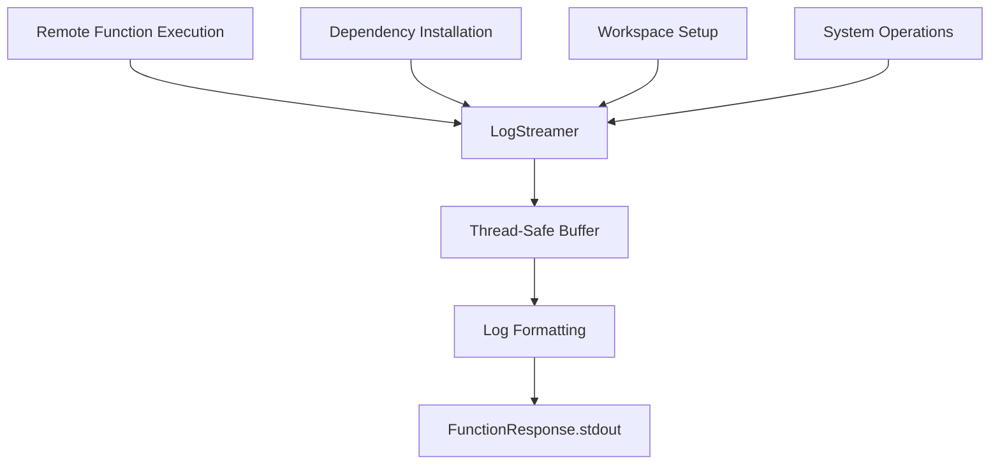
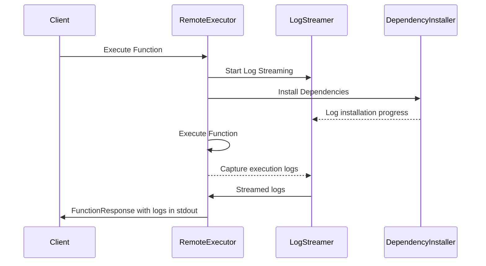

# Centralized Log Streaming System

## Overview

This design implements a comprehensive log streaming architecture that captures all system logs during remote execution and includes them in the `FunctionResponse.stdout` for complete visibility into dependency installation, workspace setup, and function execution.

## Key Components

### 1. LogStreamer (`src/log_streamer.py`)
Thread-safe log capture system that buffers logs and streams them to the response output.

### 2. Centralized Logging (`src/logger.py`)
Unified logging configuration with:
- **Debug Format**: `timestamp | level | name | file:line | message`
- **Production Format**: `timestamp | level | message`
- **Namespace**: All logs use `flash.*` hierarchy

### 3. Integration Points

## Technical Changes

### Log Namespace Consolidation
- Use `flash` namespace
- Consistent logging hierarchy across all components
- Better alignment with runpod-flash logging standards

### Memory Management
- Configurable buffer size (default: 1000 entries)
- Automatic buffer rotation prevents memory issues
- Thread-safe operations with proper locking

### Error Resilience
- Log streaming failures don't break execution
- Graceful fallback when streaming unavailable
- Robust error handling in all log operations

## Files Modified

| Component | Purpose |
|-----------|---------|
| `src/log_streamer.py` | New centralized log streaming system |
| `src/logger.py` | New unified logging configuration |
| `src/remote_executor.py` | Integration with log streaming |
| `src/dependency_installer.py` | Log capture during installation |
| `src/test_log_streaming.json` | Test case for log visibility |

## Benefits

1. **Complete Observability**: All system operations visible in function response
2. **Debugging Efficiency**: Detailed logs help diagnose issues quickly
3. **Production Ready**: Clean, structured logs with appropriate formatting
4. **Thread Safety**: Concurrent operations don't interfere with log capture
5. **Memory Efficient**: Bounded buffer prevents memory exhaustion

## Testing

- New test case validates log capture and streaming
- Integration tests verify logs from dependency installation
- All existing tests pass with new logging system
- CI/CD maintains clean output with appropriate log levels