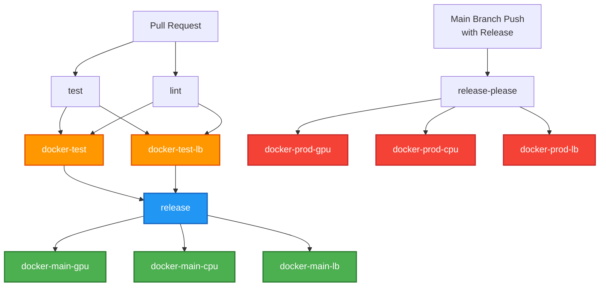

# Docker Build Pipeline

This document covers the CI/CD infrastructure for building and deploying worker-tetra Docker images.

## Overview

The worker-tetra repository maintains three Docker images:

1. **GPU Image** (`runpod/tetra-rp`) - Queue-based serverless worker with CUDA
2. **CPU Image** (`runpod/tetra-rp-cpu`) - Queue-based serverless worker for CPU-only
3. **Load Balancer Image** (`runpod/tetra-rp-lb`) - HTTP-based Load Balancer worker

All images are automatically built and pushed via GitHub Actions workflows.

## Pipeline Stages

### Stage 1: Pull Request Testing

**Trigger**: All pull requests and pushes to main

**Jobs**:
- `docker-test` - Validates GPU image builds
- `docker-test-lb` - Validates Load Balancer image builds

**What it does**:
- Builds the Docker images locally
- Validates Dockerfile syntax
- Checks that all dependencies resolve
- Does NOT push to Docker Hub

**Status checks**: Required to pass before merging

### Stage 2: Main Branch Deployment

**Trigger**: Pushes to main branch (when no release is created)

**Jobs**:
- `docker-main-gpu` - Pushes GPU image
- `docker-main-cpu` - Pushes CPU image
- `docker-main-lb` - Pushes Load Balancer image

**What it does**:
- Builds the Docker images
- Pushes to Docker Hub with `:main` tag
- Useful for testing development versions
- Skipped if a release was just created

**Image tags**:
- `runpod/tetra-rp:main`
- `runpod/tetra-rp-cpu:main`
- `runpod/tetra-rp-lb:main`

### Stage 3: Release Deployment

**Trigger**: When a release is created via release-please

**Jobs**:
- `docker-prod-gpu` - Pushes GPU image with version tags
- `docker-prod-cpu` - Pushes CPU image with version tags
- `docker-prod-lb` - Pushes Load Balancer image with version tags

**What it does**:
- Builds the Docker images
- Pushes with semantic version tags (e.g., `0.7.3`)
- Also pushes `:latest` tag
- Automatically triggered by release-please

**Image tags**:
- `runpod/tetra-rp:0.7.3` and `runpod/tetra-rp:latest`
- `runpod/tetra-rp-cpu:0.7.3` and `runpod/tetra-rp-cpu:latest`
- `runpod/tetra-rp-lb:0.7.3` and `runpod/tetra-rp-lb:latest`

## Pipeline Flow



## Building Locally

### Build GPU Image

```bash
make build-gpu
```

Builds `runpod/tetra-rp:local` for testing locally.

### Build CPU Image

```bash
make build-cpu
```

Builds `runpod/tetra-rp-cpu:local` for testing locally.

### Build Load Balancer Image

```bash
make build-lb
```

Builds `runpod/tetra-rp-lb:local` for testing locally.

### Build All Images

```bash
make build
```

Builds both GPU and CPU images (does not build Load Balancer image).

## Docker Hub Credentials

The pipeline requires Docker Hub credentials configured as GitHub repository secrets:

- **DOCKERHUB_USERNAME** - Docker Hub username
- **DOCKERHUB_TOKEN** - Docker Hub password or personal access token

These are used by the `docker/login-action` step to authenticate with Docker Hub.

## Release Process

Releases are managed automatically via `release-please`:

1. **Detect conventional commits** on main branch
2. **Create pull request** with version bump and changelog
3. **User merges** the release PR
4. **release-please** creates a Git tag and release
5. **CI/CD** triggers production image builds and pushes

### Commit Message Convention

Use conventional commit messages to trigger releases:

- `feat:` - Feature (triggers minor version bump)
- `fix:` - Bug fix (triggers patch version bump)
- `BREAKING CHANGE:` - Breaking change (triggers major version bump)

Example:
```bash
git commit -m "feat(executor): add async function execution support"
git commit -m "fix(handler): correct dependency installation order"
```

## Troubleshooting

### Docker Build Fails

1. Check `pyproject.toml` syntax
2. Verify `Dockerfile*` line endings (LF not CRLF)
3. Ensure `uv.lock` is up to date: `uv lock --upgrade`
4. Test locally: `make build-lb` (for Load Balancer)

### Image Not Pushed to Docker Hub

1. Verify Docker Hub credentials are set in GitHub secrets
2. Check CI/CD job logs for authentication errors
3. Ensure you're on main branch for main builds
4. Ensure release tag exists for production builds

### Release PR Not Created

1. Check that commits follow conventional commit format
2. Ensure `release-please` workflow is enabled
3. Verify release-please app has access to repository
4. Check repository settings > Actions permissions

## See Also

- [Load Balancer Docker Infrastructure](./Load_Balancer_Docker_Infrastructure.md)
- [System Python Runtime Architecture](./System_Python_Runtime_Architecture.md)
