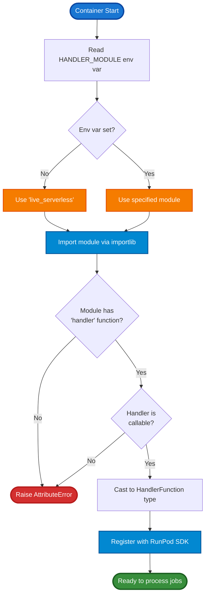

# Dynamic Handler Loading

This document explains the dynamic handler loading system that allows a single worker container to support multiple handler implementations through runtime configuration.

## Overview

The dynamic handler loading feature enables you to:

- Deploy multiple handler types using the same Docker image
- Switch handler implementations via environment variable
- Create custom handlers following a standard protocol
- Test handlers locally before deployment
- Maintain backward compatibility with existing handlers

## Architecture



## How It Works

### Loading Flow

1. **Environment Check**: [src/handler.py:21](../src/handler.py#L21) reads `HANDLER_MODULE` environment variable
2. **Default Fallback**: If not set, defaults to `live_serverless` module
3. **Dynamic Import**: Uses `importlib.import_module()` to load the specified module
4. **Validation**: Ensures the module exports a callable `handler` function
5. **Registration**: Passes the handler to `runpod.serverless.start()`

### Handler Protocol

All handlers must follow this protocol (defined in [src/handler_protocol.py](../src/handler_protocol.py)):

**Function Signature**:
```python
async def handler(event: HandlerEvent) -> Dict[str, Any]:
    """Process a job and return results."""
    pass
```

**Requirements**:
- Must be an async function (coroutine)
- Must accept `HandlerEvent` or `Dict[str, Any]`
- Must return `Dict[str, Any]`
- Must be exported as module-level `handler` function

## Configuration

### Environment Variable

**`HANDLER_MODULE`**: Specifies which Python module contains the handler function.

**Format**: Python module path (dot-separated)

**Examples**:
- `HANDLER_MODULE=live_serverless` (default)
- `HANDLER_MODULE=custom_handler`
- `HANDLER_MODULE=handlers.inference.llm_handler`
- `HANDLER_MODULE=my_package.workers.batch_processor`

### Setting the Handler

**Local Development**:
```bash
# Use default handler
python src/handler.py

# Use custom handler
HANDLER_MODULE=custom_handler python src/handler.py

# Use nested module
HANDLER_MODULE=handlers.inference.llm_handler python src/handler.py
```

**Docker Build Time**:
```bash
# Not currently supported - see TODO.md task #2
# Will be supported in future release via ARG
```

**Docker Runtime**:
```bash
# Override at container startup
docker run -e HANDLER_MODULE=custom_handler runpod/tetra-rp:latest

# With RunPod
# Set environment variable in endpoint configuration
```

**Testing**:
```bash
# Test with custom handler
HANDLER_MODULE=custom_handler make test-handler

# Test specific JSON file
HANDLER_MODULE=custom_handler python src/handler.py --test_input "$(cat src/tests/test_input.json)"
```

## Creating Custom Handlers

### Minimal Handler

```python
# my_handler.py
from typing import Dict, Any
from handler_protocol import HandlerEvent

async def handler(event: HandlerEvent) -> Dict[str, Any]:
    """Minimal handler that echoes input."""
    return {
        "success": True,
        "result": event.input,
        "error": None
    }
```

### Handler with Error Handling

```python
# robust_handler.py
from typing import Dict, Any
import traceback
from handler_protocol import HandlerEvent

async def handler(event: HandlerEvent) -> Dict[str, Any]:
    """Handler with comprehensive error handling."""
    try:
        # Extract input
        user_input = event.input.get("data")

        # Validate
        if not user_input:
            return {
                "success": False,
                "error": "Missing 'data' field in input",
                "result": None
            }

        # Process
        result = process_data(user_input)

        # Return success
        return {
            "success": True,
            "result": result,
            "error": None
        }

    except Exception as e:
        return {
            "success": False,
            "error": f"{type(e).__name__}: {str(e)}",
            "traceback": traceback.format_exc(),
            "result": None
        }

def process_data(data):
    """Business logic implementation."""
    return {"processed": data}
```

### Handler with Backward Compatibility

```python
# compatible_handler.py
from typing import Dict, Any, Union
from handler_protocol import HandlerEvent

async def handler(event: Union[HandlerEvent, Dict[str, Any]]) -> Dict[str, Any]:
    """Handler supporting both HandlerEvent and raw dict input."""
    # Coerce dict to HandlerEvent if needed
    if isinstance(event, dict):
        event = HandlerEvent(**event)

    # Process normally
    return {
        "success": True,
        "result": event.input.get("value"),
        "error": None
    }
```

## Testing Custom Handlers

### Unit Testing

```python
# test_my_handler.py
import pytest
from my_handler import handler
from handler_protocol import HandlerEvent

@pytest.mark.asyncio
async def test_handler_success():
    """Test successful handler execution."""
    event = HandlerEvent(input={"data": "test"})
    result = await handler(event)

    assert result["success"] is True
    assert result["error"] is None
    assert result["result"] is not None

@pytest.mark.asyncio
async def test_handler_error():
    """Test handler error handling."""
    event = HandlerEvent(input={})  # Missing required data
    result = await handler(event)

    assert result["success"] is False
    assert result["error"] is not None
```

### Integration Testing

```bash
# Create test input file
cat > test_my_handler.json << EOF
{
    "input": {
        "data": "integration test"
    }
}
EOF

# Test handler with file
HANDLER_MODULE=my_handler python src/handler.py --test_input "$(cat test_my_handler.json)"
```

### Using Test Script

```bash
# Place test JSON files in src/tests/
cp test_my_handler.json src/tests/

# Run all tests with custom handler
HANDLER_MODULE=my_handler ./src/test-handler.sh
```

## Deployment

### Step 1: Prepare Handler Module

```bash
# Add your handler to src/ directory
cp my_handler.py src/

# Or create handlers package
mkdir -p src/handlers
cp my_handler.py src/handlers/
```

### Step 2: Test Locally

```bash
# Test with your handler
HANDLER_MODULE=my_handler make test-handler

# Or if using package structure
HANDLER_MODULE=handlers.my_handler make test-handler
```

### Step 3: Build Docker Image

```bash
# Build with your handler code included
make build

# Image will contain all handlers in src/
```

### Step 4: Deploy to RunPod

**Option A: Environment Variable (Recommended)**
1. Create endpoint in RunPod dashboard
2. Set environment variable: `HANDLER_MODULE=my_handler`
3. Deploy using `runpod/tetra-rp:latest` image

**Option B: Custom Image**
1. Push custom image with your handler
2. Configure endpoint to use your image
3. Set `HANDLER_MODULE` if handler is not named `live_serverless`

### Step 5: Verify Deployment

```bash
# Test deployed endpoint
runpod run --endpoint-id YOUR_ENDPOINT_ID --input '{"data": "test"}'
```

## Handler Examples

See [docs/examples/](./examples/) for complete working examples:

- [simple_echo_handler.py](./examples/simple_echo_handler.py) - Minimal implementation
- [inference_handler.py](./examples/inference_handler.py) - LLM inference pattern
- [batch_processing_handler.py](./examples/batch_processing_handler.py) - Batch data processing

## Troubleshooting

### Module Not Found

**Error**: `ImportError: No module named 'my_handler'`

**Solutions**:
- Ensure handler file is in `src/` directory or Python path
- Check module name matches file name (without `.py`)
- For packages, ensure `__init__.py` exists
- Verify module path uses dots not slashes: `handlers.my_handler` not `handlers/my_handler`

### Handler Not Found

**Error**: `AttributeError: Module 'my_handler' does not export a 'handler' function`

**Solutions**:
- Ensure function is named exactly `handler` (lowercase)
- Check function is defined at module level (not inside class or another function)
- Verify function is not commented out or conditionally defined

### Handler Not Callable

**Error**: `TypeError: 'handler' in module 'my_handler' is not callable`

**Solutions**:
- Ensure `handler` is a function, not a variable or constant
- Check you're not assigning to `handler` after defining it
- Verify function definition is complete (no syntax errors)

### Handler Type Errors

**Error**: Handler executes but returns wrong type

**Solutions**:
- Ensure handler returns `Dict[str, Any]`, not other types
- Use type hints to catch issues: `-> Dict[str, Any]`
- Check return statement returns dictionary with `success`, `result`, `error` keys

### Import Errors in Handler

**Error**: Handler imports fail when loaded

**Solutions**:
- Install dependencies in Docker image via `pyproject.toml`
- For dynamic dependencies, use `live_serverless` handler's dependency installation
- Check Python path includes handler's package location

## Best Practices

### Handler Design

1. **Single Responsibility**: Each handler should have one clear purpose
2. **Error Handling**: Always catch and return exceptions, never let them propagate
3. **Input Validation**: Validate all inputs before processing
4. **Consistent Response**: Always return dict with `success`, `result`, `error` keys
5. **Logging**: Use structured logging, not print statements (unless in `live_serverless`)
6. **Async/Await**: Use async properly, don't block the event loop

### Code Organization

1. **Module Structure**: Use packages for complex handlers (`handlers/inference/`)
2. **Separation**: Keep handler logic separate from business logic
3. **Reusability**: Extract common code to shared modules
4. **Testing**: Write unit tests for handler and integration tests for full flow

### Performance

1. **Initialization**: Load models/resources outside handler function if possible
2. **Caching**: Cache expensive operations when safe
3. **Cleanup**: Properly close connections and release resources
4. **Timeout**: Handle long-running operations with timeouts

### Security

1. **Input Sanitization**: Never trust user input
2. **Secrets**: Use environment variables, not hardcoded values
3. **Validation**: Validate types and ranges for all inputs
4. **Sandboxing**: Be aware handlers execute arbitrary code in `live_serverless`

## Migration Guide

### From Legacy Handler

**Before** (old `handler.py` approach):
```python
# handler.py
def handler(event):
    result = process(event["input"])
    return {"output": result}

if __name__ == "__main__":
    import runpod
    runpod.serverless.start({"handler": handler})
```

**After** (using dynamic loading):
```python
# my_legacy_handler.py
async def handler(event):
    # Make async
    result = await process_async(event["input"])
    return {"output": result}

# No runpod.serverless.start needed
```

**Usage**:
```bash
HANDLER_MODULE=my_legacy_handler python src/handler.py
```

### Gradual Migration

1. Create new handler file alongside existing code
2. Test with `HANDLER_MODULE` locally
3. Deploy with environment variable override
4. Validate in production
5. Update default or remove old handler

## Technical Reference

For detailed protocol specifications, see [Handler_Protocol_Reference.md](./Handler_Protocol_Reference.md).

## Related Documentation

- [Handler Protocol Reference](./Handler_Protocol_Reference.md) - Protocol specifications
- [CLAUDE.md](../CLAUDE.md) - Project architecture and development guide
- [TODO.md](../TODO.md) - Future enhancements and roadmap
- [src/handler.py](../src/handler.py#L10-L57) - Implementation details
- [tests/unit/test_handler_loader.py](../tests/unit/test_handler_loader.py) - Test examples
