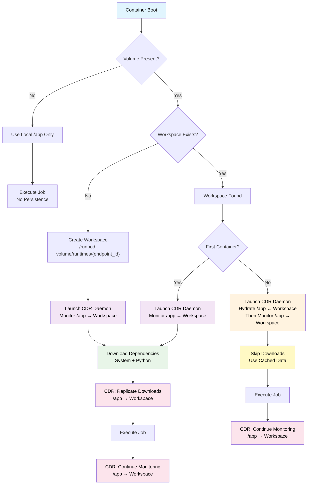

# Endpoint Persistence using Network Volume and CDR

## Definitions

- Worker: docker container that relies on their local sandbox environment `/app` for all of its operations.

- Volume: network volume attached to a Worker as provisioned by its parent Endpoint.

- Workspace: designated environment residing in the network volume `/runpod-volume/runtimes/{endpoint_id}`. Serves as an Endpoint persistence disk.

- CDR: continuous data replication daemon that ensures data is replicated to the network volume workspace with an optional "hydrate" function (data transfers from volume to container)

## Logic

- First container boots, and checks for volume presence and endpoint workspace. Create if not found.

   1. Container will proceed to download any system or python dependencies in parallel as instructed from the remote decorator.

   2. Container runs its job.

   3. Container launches its own CDR daemon to monitor `/app` for changes and replicates `/app` to `/runpod-volume/runtimes/{endpoint_id}` as files are downloaded or changed.

- Subsequent container boots, and checks for volume presence and endpoint workspace. Found.

   1. Container launches its own CDR daemon to hydrate its `/app` from the workspace and then watch `/app` for changes.

   2. Container completely skips downloading from the internet.

   3. Container runs its job.

### Logic Flow
