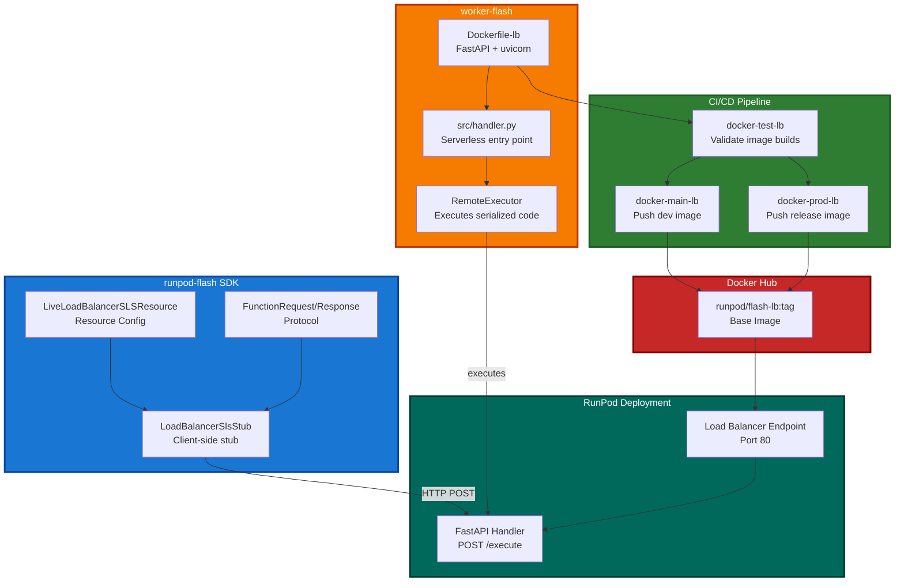
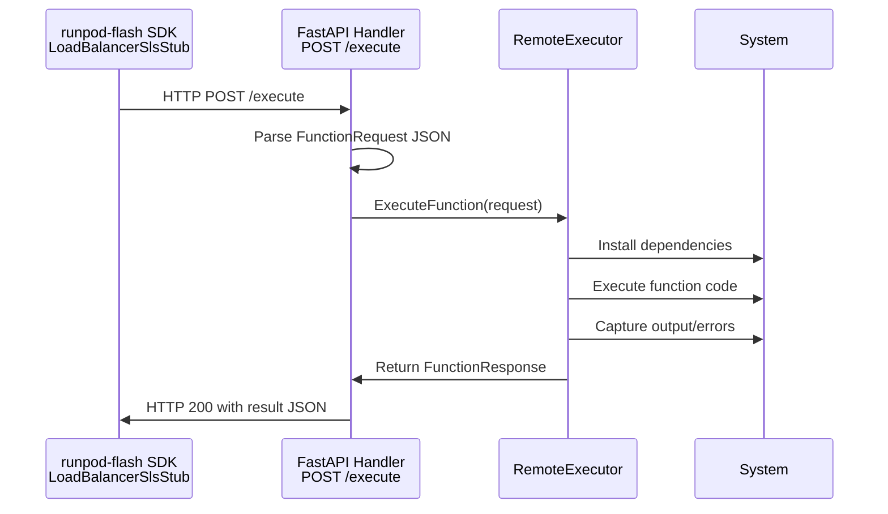

# Load Balancer Docker Infrastructure

## Overview

This document covers the Docker infrastructure supporting **LiveLoadBalancerSLSResource remote code execution** in worker-flash. This enables executing serialized Python functions via HTTP `/execute` endpoint during local development and testing.

### Purpose

- **Remote code execution**: Execute arbitrary Python functions via HTTP POST to `/execute` endpoint
- **Function serialization**: Send function code, arguments, and dependencies as JSON payload
- **Local development**: LiveLoadBalancer resource provides `/execute` for testing before production deployment
- **HTTP-based communication**: Direct HTTP requests/responses instead of RunPod job queue

### Integration with runpod-flash

The runpod-flash pip dependency provides:

- **Resource Classes**: `LoadBalancerSlsResource` (base) and `LiveLoadBalancer` (local dev with /execute)
- **Stub Implementation**: `LoadBalancerSlsStub` routes HTTP requests to handler functions
- **Protocol**: `FunctionRequest`/`FunctionResponse` for serialized code execution

Worker-flash provides the Docker infrastructure to run the handler that processes these requests.

## Architecture

### Complete Flow



### /execute Endpoint Execution



## Docker Image (Dockerfile-lb)

### Base Image

```dockerfile
FROM pytorch/pytorch:2.8.0-cuda12.8-cudnn9-runtime
```

Uses PyTorch CUDA runtime to support GPU-accelerated functions. This matches the queue-based Dockerfile but with different CMD and dependencies.

### Key Configuration

| Aspect | Queue-Based (Dockerfile) | Load Balancer (Dockerfile-lb) |
|--------|------------------------|------|
| Handler Entry | `runpod.serverless.start()` | `uvicorn handler:app` |
| Communication | RunPod job queue | HTTP requests |
| Port | Job polling (no port) | Port 80 |
| Handler | Single `handler.py` | Generated `handler_*.py` |
| Framework | RunPod SDK | FastAPI + uvicorn |
| Request Type | Batch (job queue) | Synchronous HTTP |

### Dependencies

Added to `pyproject.toml`:

```toml
dependencies = [
    "fastapi>=0.115.0",
    "uvicorn[standard]>=0.34.0",
    # ... existing dependencies ...
]
```

**FastAPI**: Web framework for HTTP routing and request handling
**uvicorn**: ASGI server for running FastAPI applications

### Environment Variables

```dockerfile
ENV HF_HUB_ENABLE_HF_TRANSFER=1      # HuggingFace acceleration
ENV HF_HOME=/hf-cache               # Cache location
ENV DEBIAN_FRONTEND=noninteractive  # No interactive prompts
ENV TZ=Etc/UTC                      # Timezone
```

### CMD Strategy

```dockerfile
CMD ["uvicorn", "handler:app", "--host", "0.0.0.0", "--port", "80", "--timeout-keep-alive", "600"]
```

This is a **placeholder**. RunPod overrides the CMD at runtime to run the specific generated handler:

```bash
uvicorn handler_api:app --host 0.0.0.0 --port 80
```

Different endpoints can use different generated handlers (e.g., `handler_api`, `handler_service`).

## Building the Image

### Local Build

Build the Load Balancer image locally for testing:

```bash
make build-lb
```

This builds and tags as `runpod/flash-lb:local` and loads into local Docker daemon.

### CI/CD Build

The image is automatically built and pushed via GitHub Actions:

- **Pull requests**: `docker-test-lb` job validates the build
- **Main branch**: `docker-main-lb` job pushes `:main` tag
- **Releases**: `docker-prod-lb` job pushes semantic version and `:latest` tags

See [Docker Build Pipeline](./Docker_Build_Pipeline.md) for details on the CI/CD process.

## Handler Implementation

The handler processes `/execute` requests by:

1. **Receiving** HTTP POST to `/execute` with `FunctionRequest` JSON payload
2. **Parsing** the request containing:
   - `function_code`: Source code of function to execute
   - `function_name`: Name of function to call
   - `args`: Base64-encoded cloudpickle serialized arguments
   - `kwargs`: Base64-encoded cloudpickle serialized keyword arguments
   - `dependencies`: List of Python packages to install
   - `system_dependencies`: List of system packages to install
3. **Installing** dependencies as needed
4. **Executing** the function in an isolated namespace
5. **Capturing** stdout, stderr, logs, and return value
6. **Returning** `FunctionResponse` with result or error

### /execute Request Example

```bash
curl -X POST http://localhost:80/execute \
  -H "Content-Type: application/json" \
  -d '{
    "function_name": "add",
    "function_code": "def add(a, b):\n    return a + b",
    "args": ["<base64-encoded-5>", "<base64-encoded-3>"],
    "dependencies": []
  }'
```

### /execute Response Example

```json
{
  "success": true,
  "result": "<base64-encoded-8>",
  "stdout": null,
  "error": null
}
```

## Local Development with LiveLoadBalancer

LiveLoadBalancer enables testing the `/execute` endpoint locally before deployment:

```python
from runpod_flash import remote, LiveLoadBalancer

config = LiveLoadBalancer(name="test-endpoint")

@remote(config)
def my_function(x):
    return x * 2
```

When using `LiveLoadBalancer`:
- The `/execute` endpoint is **available** for local testing
- You can serialize and send function code via HTTP
- Test the full execution pipeline locally

When deployed as `LoadBalancerSlsResource`:
- The `/execute` endpoint is **not available** (security)
- Only user-defined routes are exposed
- Production endpoints prevent arbitrary code execution

## Testing the Handler

Test the Load Balancer handler's `/execute` endpoint locally:

### Using the Test Script

```bash
make test-lb-handler
```

This script:
1. Starts the FastAPI server on port 80
2. Validates the `/health` endpoint
3. Runs all `tests/test_*.json` files against `/execute`
4. Reports pass/fail results
5. Cleans up the server

### Manual Testing

Start the server:

```bash
uvicorn src.lb_handler:app --port 80
```

Test the health endpoint:

```bash
curl http://localhost:80/health
```

Test the execute endpoint:

```bash
curl -X POST http://localhost:80/execute \
  -H "Content-Type: application/json" \
  -d '{
    "function_name": "add",
    "function_code": "def add(a, b):\n    return a + b",
    "args": ["base64_encoded_5", "base64_encoded_3"],
    "dependencies": []
  }'
```

### Test File Format

Create test files in `src/tests/test_*.json`:

```json
{
  "function_name": "my_function",
  "function_code": "def my_function(x):\n    return x * 2",
  "args": ["base64_encoded_arg"],
  "kwargs": {},
  "dependencies": [],
  "system_dependencies": [],
  "accelerate_downloads": false
}
```

Note: Arguments must be base64-encoded cloudpickle serialized values.

## Troubleshooting

### Docker Build Fails

1. Check `pyproject.toml` for syntax errors
2. Verify `Dockerfile-lb` line endings (CRLF vs LF)
3. Ensure uv.lock is up to date: `uv lock --upgrade`
4. Run `make build-lb` to validate locally

### /execute Endpoint Not Responding

1. Verify endpoint is deployed and in "Ready" state
2. Check port 80 is exposed: `EXPOSE 80` in Dockerfile-lb
3. Verify FastAPI handler is started: check container logs
4. Test with simple request first

### Function Execution Fails

1. Check dependencies are listed in `FunctionRequest`
2. Verify function code syntax
3. Check for import errors in dependencies
4. Review captured `stdout` and `error` fields in response

### Missing Dependencies in Handler

1. Add package to `pyproject.toml`
2. Update uv.lock: `uv lock`
3. Rebuild Docker image: `make build-lb`

## See Also

- [Docker Build Pipeline](./Docker_Build_Pipeline.md) - CI/CD infrastructure for building and pushing images
- [System Python Runtime Architecture](./System_Python_Runtime_Architecture.md) - Details on the execution engine
- [runpod-flash Repository](https://github.com/runpod/flash) - SDK source code and documentation
- [runpod-flash LiveLoadBalancer Documentation](https://github.com/runpod/flash#liveloadbalancer) - Load balancer resource documentation
