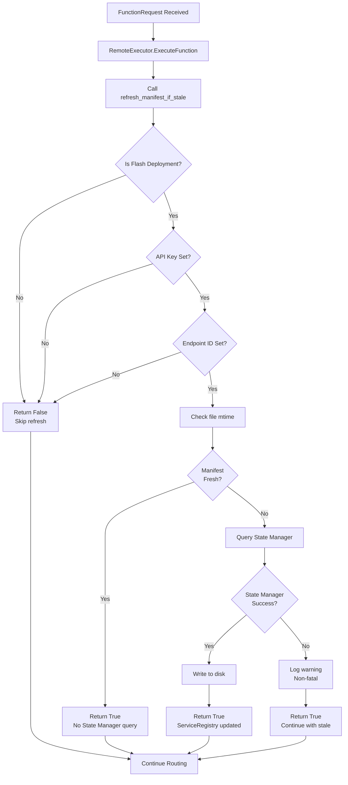

# Manifest Reconciliation

## Overview

Manifest reconciliation is a request-scoped mechanism that keeps the local Flash manifest synchronized with RunPod's State Manager. It ensures that cross-endpoint routing has access to fresh endpoint URLs without blocking worker startup or requiring background threads (which are incompatible with serverless containers).

### What Is Manifest Reconciliation?

In Flash deployments, endpoints are pre-deployed with a local manifest artifact (`/app/flash_manifest.json`) that contains function definitions. However, endpoint URLs are not known until provisioning completes. These URLs are stored in State Manager (the authoritative source). Without synchronization, ServiceRegistry cannot route functions to their proper endpoints.

### Why TTL-Based Approach?

Traditional approaches present problems:
- **Boot-time blocking**: Querying State Manager at startup blocks cold starts (serverless incompatible)
- **Background threads**: Daemon threads don't work in ephemeral containers that disappear after requests
- **Completeness checking**: Requires knowing expected endpoints upfront (changes dynamically)

The TTL-based approach solves this by:
- Checking manifest file modification time (≤1ms, no API call)
- Only querying State Manager if manifest is older than 5 minutes
- Doing this during cross-endpoint routing (when URLs are actually needed)
- Gracefully degrading if State Manager is unavailable

### Serverless Compatibility

This implementation is serverless-compatible because:
- **No boot-time queries**: Workers start immediately with local manifest
- **No background threads**: All operations are request-scoped
- **Non-blocking**: TTL checks use file stats, not API calls
- **Graceful degradation**: State Manager unavailability doesn't crash the worker

---

## How It Works

### Request-Scoped Refresh Flow



### TTL-Based Staleness Detection

The manifest staleness check is simple and efficient:

```python
age_seconds = time.time() - manifest_path.stat().st_mtime
is_stale = age_seconds >= ttl_seconds  # Default ttl_seconds = 300
```

**Key points:**
- Uses file modification time (filesystem metadata, no I/O)
- Default TTL is 5 minutes (300 seconds)
- Boundary: manifest at exactly TTL is considered stale (≥ check)
- Missing manifest is always considered stale

### State Manager as Source of Truth

When refresh succeeds:
1. StateManagerClient queries the GraphQL endpoint
2. State Manager returns complete manifest with endpoint URLs
3. Local manifest on disk is replaced entirely
4. ServiceRegistry reads the updated manifest

**Conflict resolution**: State Manager always wins. If there's a difference between local and State Manager manifests, the State Manager version is used.

---

## Architecture

### Core Module: `src/manifest_reconciliation.py`

The manifest reconciliation module (`src/manifest_reconciliation.py:1-196`) provides:

**Main function:**
- `refresh_manifest_if_stale()` - Entry point called by RemoteExecutor
  - Args: `manifest_path`, `ttl_seconds`
  - Returns: `bool` (True = fresh or refresh succeeded)
  - Non-fatal errors: Returns True to continue execution

**Helper functions:**
- `is_flash_deployment()` - Detects if running in Flash mode
- `_is_manifest_stale()` - Checks if manifest is older than TTL
- `_load_local_manifest()` - Loads manifest from disk
- `_save_manifest()` - Writes manifest to disk
- `_fetch_and_save_manifest()` - Queries State Manager and saves result

### Integration Point: `src/remote_executor.py`

RemoteExecutor integrates manifest refresh (`src/remote_executor.py:95-101`):

```python
# Refresh manifest from State Manager if stale (before routing decisions)
# This ensures ServiceRegistry has fresh endpoint URLs for cross-endpoint routing
try:
    await refresh_manifest_if_stale(Path(FLASH_MANIFEST_PATH))
except Exception as e:
    self.logger.debug(f"Manifest refresh failed (non-fatal): {e}")
    # Continue with potentially stale manifest
```

This call happens **before** cross-endpoint routing (`src/remote_executor.py:147-184`), ensuring ServiceRegistry has fresh URLs when needed.

### Flash Deployment Detection

Detection uses environment variables set by RunPod provisioning:

```python
def is_flash_deployment() -> bool:
    endpoint_id = os.getenv("RUNPOD_ENDPOINT_ID")
    is_flash = any([
        os.getenv("FLASH_IS_MOTHERSHIP") == "true",
        os.getenv("FLASH_MOTHERSHIP_ID"),
        os.getenv("FLASH_RESOURCE_NAME"),
    ])
    return bool(endpoint_id and is_flash)
```

All three conditions must be true:
1. `RUNPOD_ENDPOINT_ID` must be set
2. At least one Flash indicator must be set

### ServiceRegistry Interaction

ServiceRegistry is initialized with the manifest path (`src/remote_executor.py:48`):

```python
self.service_registry = ServiceRegistry(manifest_path=Path(FLASH_MANIFEST_PATH))
```

When manifest is refreshed, ServiceRegistry automatically picks up changes on next read (it reads the file fresh for each lookup).

---

## Key Functions

### `refresh_manifest_if_stale()`

**Signature:**
```python
async def refresh_manifest_if_stale(
    manifest_path: Path = Path(FLASH_MANIFEST_PATH),
    ttl_seconds: int = DEFAULT_MANIFEST_TTL_SECONDS,
) -> bool:
```

**Behavior:**
1. Skip if not in Flash deployment
2. Skip if `RUNPOD_ENDPOINT_ID` or `RUNPOD_API_KEY` not set
3. Check if manifest is fresh (< TTL old)
4. If stale: Query State Manager, write to disk
5. Return True on success or fresh manifest
6. Return False only if Flash deployment not detected

**Example:**
```python
from pathlib import Path
from manifest_reconciliation import refresh_manifest_if_stale

# Use defaults (5-minute TTL)
success = await refresh_manifest_if_stale()

# Custom TTL (10 minutes)
success = await refresh_manifest_if_stale(ttl_seconds=600)
```

### `_is_manifest_stale()`

**Signature:**
```python
def _is_manifest_stale(
    manifest_path: Path,
    ttl_seconds: int = DEFAULT_MANIFEST_TTL_SECONDS,
) -> bool:
```

**Returns:**
- `True`: Manifest is missing or older than TTL
- `False`: Manifest is fresh (newer than TTL)

**Example:**
```python
from manifest_reconciliation import _is_manifest_stale
from pathlib import Path

manifest_path = Path("/app/flash_manifest.json")
if _is_manifest_stale(manifest_path, ttl_seconds=300):
    print("Manifest needs refresh")
```

### `_fetch_and_save_manifest()`

**Signature:**
```python
async def _fetch_and_save_manifest(
    manifest_path: Path,
    endpoint_id: str,
) -> bool:
```

**Behavior:**
- Imports StateManagerClient from tetra_rp
- Calls `get_persisted_manifest(endpoint_id)`
- Writes result to `manifest_path`
- Returns True on success, False on error

**Error handling:** Non-fatal. Logs warnings but doesn't raise.

### `is_flash_deployment()`

**Signature:**
```python
def is_flash_deployment() -> bool:
```

**Returns:** `True` if running in Flash deployment mode

**Example:**
```python
from manifest_reconciliation import is_flash_deployment

if is_flash_deployment():
    print("Running in Flash deployment")
else:
    print("Running in Live Serverless or other mode")
```

---

## Environment Variables

### Required Variables

**`RUNPOD_ENDPOINT_ID`**
- Set by RunPod provisioning system
- Uniquely identifies this endpoint
- Used to query State Manager for this endpoint's manifest

**`RUNPOD_API_KEY`**
- Set by RunPod provisioning system
- Authentication for State Manager API
- Refresh is skipped if not set

### Flash Detection Variables

At least one of these must be set to detect Flash deployment:

**`FLASH_IS_MOTHERSHIP`**
- Set to `"true"` for mothership endpoints
- Indicates this is a Flash deployed endpoint

**`FLASH_MOTHERSHIP_ID`**
- Set to mothership endpoint ID
- Indicates this endpoint is part of a Flash deployment

**`FLASH_RESOURCE_NAME`**
- Set to resource name (e.g., "cpu_endpoint", "gpu_endpoint")
- Indicates which resource this worker is running

### Optional Variables

**`FLASH_MANIFEST_PATH`**
- Default: `/app/flash_manifest.json`
- Can be overridden for testing or special deployments

---

## Usage Examples

### Default Behavior (In RemoteExecutor)

Manifest refresh is called automatically before cross-endpoint routing:

```python
# In RemoteExecutor.ExecuteFunction()
try:
    await refresh_manifest_if_stale(Path(FLASH_MANIFEST_PATH))
except Exception as e:
    self.logger.debug(f"Manifest refresh failed (non-fatal): {e}")
    # Continue with potentially stale manifest
```

No additional setup required - just call and ignore non-fatal errors.

### Custom TTL Configuration

Change how often manifest refreshes:

```python
from pathlib import Path
from manifest_reconciliation import refresh_manifest_if_stale

# Refresh every 10 minutes instead of 5
await refresh_manifest_if_stale(ttl_seconds=600)

# Aggressive: refresh every 1 minute
await refresh_manifest_if_stale(ttl_seconds=60)

# Conservative: refresh every 30 minutes
await refresh_manifest_if_stale(ttl_seconds=1800)
```

### Manual Staleness Check

Check if manifest is stale without refreshing:

```python
from pathlib import Path
from manifest_reconciliation import _is_manifest_stale

manifest_path = Path("/app/flash_manifest.json")

if _is_manifest_stale(manifest_path):
    print("Manifest is stale and will refresh on next routing request")
else:
    print(f"Manifest is fresh (refreshed within last 5 minutes)")
```

---

## Error Handling

### Non-Fatal Error Strategy

All errors during refresh are non-fatal:

| Error | Behavior | Log Level |
|-------|----------|-----------|
| State Manager query fails | Continue with stale manifest | Warning |
| State Manager returns empty | Continue with stale manifest | Warning |
| Disk write fails | Continue with stale manifest | Error |
| API key missing | Skip refresh | Debug |
| Endpoint ID missing | Skip refresh | Debug |
| Not Flash deployment | Skip refresh | N/A |

### State Manager Unavailability

If State Manager is temporarily unavailable:

1. `_fetch_and_save_manifest()` logs warning
2. Refresh returns False
3. Worker continues with potentially stale manifest
4. Next request after 5 minutes retries refresh
5. Workers degrade gracefully (may fail routing, but don't crash)

### Missing API Key

If `RUNPOD_API_KEY` is not set:

```python
api_key = os.getenv("RUNPOD_API_KEY")
if not api_key:
    logger.debug("RUNPOD_API_KEY not set, skipping manifest refresh")
    return False
```

This is expected in Live Serverless mode (non-Flash deployments).

### Disk Write Errors

If manifest cannot be written to disk (disk full, permissions):

```python
try:
    manifest_path.write_text(json.dumps(manifest, indent=2))
    return True
except OSError as e:
    logger.error(f"Failed to write manifest to {manifest_path}: {e}")
    return False
```

Worker continues with old manifest - this prevents crashes from filling the disk.

---

## Performance Characteristics

### Boot-Time Latency

**0 additional milliseconds**

Manifest refresh is not called at boot. Workers start immediately with local manifest.

### Fresh Manifest Check

**~1 millisecond**

Checking if manifest is fresh uses only `stat()` system call (filesystem metadata):

```python
mtime = manifest_path.stat().st_mtime
age_seconds = time.time() - mtime
```

No I/O, no API calls.

### Stale Manifest Refresh

**100-500 milliseconds**

When manifest is stale, a GraphQL query to State Manager is executed:

```
GraphQL query time: 50-400ms (dependent on State Manager latency)
Disk write time: 10-50ms (dependent on manifest size)
Total: 100-500ms
```

### Query Frequency

Maximum once per 5 minutes (default TTL)

- First routing request after manifest becomes stale: Full refresh (100-500ms)
- All subsequent requests within 5 minutes: Only stat() check (1ms)
- After 5 minutes: Next refresh happens

### Memory Usage

**~100KB for manifest + StateManagerClient**

- Average Flash manifest: 5-50KB (function registry + resource definitions)
- StateManagerClient library: ~50KB
- Total per worker: <100KB

---

## Manifest Structure

### Local Manifest (Build Artifact)

```json
{
  "version": "1.0",
  "generated_at": "2026-01-22T00:00:00Z",
  "project_name": "my_app",
  "resources": {
    "cpu_endpoint": {
      "resource_type": "CpuLiveLoadBalancer",
      "handler_file": "handler.py",
      "config_hash": "abc123",
      "functions": [
        {
          "name": "cpu_task",
          "module": "workers.cpu",
          "is_async": true,
          "is_class": false
        }
      ]
    }
  },
  "function_registry": {
    "cpu_task": "cpu_endpoint"
  }
}
```

**Note:** No `endpoint_url` fields in local manifest (not known until provisioning).

### State Manager Manifest (With URLs)

State Manager adds endpoint URLs to the manifest:

```json
{
  "version": "1.0",
  "generated_at": "2026-01-22T00:00:00Z",
  "project_name": "my_app",
  "resources": {
    "cpu_endpoint": {
      "resource_type": "CpuLiveLoadBalancer",
      "handler_file": "handler.py",
      "config_hash": "abc123",
      "endpoint_url": "https://ep-cpu-001.runpod.io",
      "status": "healthy",
      "functions": [
        {
          "name": "cpu_task",
          "module": "workers.cpu",
          "is_async": true,
          "is_class": false
        }
      ]
    }
  },
  "function_registry": {
    "cpu_task": "cpu_endpoint"
  }
}
```

**Added fields:**
- `endpoint_url`: Full URL to this endpoint
- `status`: Endpoint health status

---

## Testing

### Unit Test Coverage

30+ unit tests in `tests/unit/test_manifest_reconciliation.py`:

**Test categories:**
- Flash deployment detection (5 tests)
- Manifest staleness checks (8 tests)
- Manifest loading and saving (6 tests)
- State Manager integration (7 tests)
- Error handling (4 tests)

**Run unit tests:**
```bash
make test-unit
# or
python -m pytest tests/unit/test_manifest_reconciliation.py -xvs
```

### Integration Test Coverage

15+ integration tests in `tests/integration/test_manifest_state_manager.py`:

**Test scenarios:**
- First deployment (stale manifest refresh)
- Update deployment (fresh manifest, no refresh)
- Scale-out (new endpoints)
- State Manager failures
- Concurrent worker refreshes
- Custom TTL configurations

**Run integration tests:**
```bash
make test-integration
# or
python -m pytest tests/integration/test_manifest_state_manager.py -xvs
```

### Full Quality Check

All tests, linting, type checking:

```bash
make quality-check
```

This runs:
- `pytest` with coverage reporting
- `ruff format --check`
- `ruff check`
- `mypy`
- Coverage threshold validation (35% minimum)

---

## Troubleshooting

### Debug Logging

Enable debug-level logging to see detailed refresh information:

```bash
# Set logging level
export LOG_LEVEL=DEBUG

# Run worker
python -m handler
```

Debug logs will show:
- Flash deployment detection
- TTL staleness checks
- State Manager queries
- Manifest refresh success/failure

### Check Manifest Age

View how old the local manifest is:

```bash
stat /app/flash_manifest.json
# Look for "Modify:" timestamp

# Or calculate age:
python3 -c "
import time
from pathlib import Path
mtime = Path('/app/flash_manifest.json').stat().st_mtime
age = time.time() - mtime
print(f'Manifest age: {age:.0f} seconds')
"
```

### Verify State Manager Connectivity

Check if State Manager is reachable:

```python
import asyncio
from tetra_rp.runtime.state_manager_client import StateManagerClient

async def test_state_manager():
    client = StateManagerClient()
    manifest = await client.get_persisted_manifest("YOUR_ENDPOINT_ID")
    if manifest:
        print("State Manager: Connected")
        print(f"Resources: {list(manifest.get('resources', {}).keys())}")
    else:
        print("State Manager: No manifest found")

asyncio.run(test_state_manager())
```

### Common Issues

**Issue: Manifest never refreshes**
- Check: Is `RUNPOD_ENDPOINT_ID` set?
- Check: Is `RUNPOD_API_KEY` set?
- Check: Is Flash deployment detected? (Check env vars)
- Solution: Refresh only happens in Flash deployments with both env vars set

**Issue: Routing fails with "endpoint_url not found"**
- Check: Is manifest fresh? (`stat /app/flash_manifest.json`)
- Check: Did State Manager have endpoint URLs? (Check in UI)
- Solution: Wait for next refresh (5-min TTL) or force refresh by touching manifest

**Issue: State Manager query times out**
- Check: Is network connectivity available?
- Check: Is State Manager service running?
- Solution: Worker continues with stale manifest, no crash

**Issue: Disk write fails**
- Check: Is disk full? (`df -h`)
- Check: Are permissions correct? (`ls -la /app`)
- Solution: Worker continues with old manifest, may need disk cleanup

---

## Design Decisions

### Request-Scoped Refresh (Not Boot-Time)

**Decision:** Manifest refresh happens during cross-endpoint routing, not at boot.

**Why:**
- Serverless containers don't persist between requests
- Background threads don't work in ephemeral containers
- Boot-time queries would block cold starts

**Tradeoff:** First routing request after 5 minutes may have 100-500ms latency (State Manager query).

### TTL-Based Staleness (Not Completeness Check)

**Decision:** Use file modification time to detect staleness, not manifest content validation.

**Why:**
- Simple and requires no external state
- Expected endpoints change dynamically (can't hardcode list)
- File stat() is much faster than comparing manifests

**Tradeoff:** May use slightly stale manifest (up to 5 minutes old) in rare cases.

### Non-Fatal Error Handling

**Decision:** State Manager errors don't crash the worker, continue with stale manifest.

**Why:**
- Manifest staleness is less critical than worker availability
- Gradual degradation is better than hard failures
- Auto-recovery on next request

**Tradeoff:** May use very stale manifest if State Manager is down for extended period.

### Workers Never Write State Manager

**Decision:** Only CLI/provisioning system writes to State Manager, workers only read.

**Why:**
- Avoids race conditions and concurrent writes
- CLI is single writer with atomic updates
- Simple concurrency model

**Tradeoff:** Workers can't trigger immediate manifest updates, must wait for TTL.

---

## Backward Compatibility

### Live Serverless Mode

Live Serverless deployments (dynamic code sent with each request) are unaffected:

- Manifest refresh only runs in Flash deployments (env var check)
- Live Serverless doesn't set Flash environment variables
- Refresh is skipped, no behavior change

### Flash Without State Manager

Flash deployments without State Manager available work gracefully:

- Refresh fails with warning (non-fatal)
- Worker continues with local manifest
- Routing uses local endpoints only
- No crashes or failures

### Existing APIs

All handler and executor APIs remain unchanged:

- `RemoteExecutor.ExecuteFunction()` - same interface
- `FunctionRequest` / `FunctionResponse` - same format
- All serialization utilities - unchanged

No breaking changes for clients.

---

## Related Documentation

- **PRD**: `docs/State_Manager_Manifest_Integration_PRD.md` - Implementation requirements and design decisions
- **ServiceRegistry**: tetra-rp ServiceRegistry documentation - Manifest reading and function lookup
- **State Manager**: RunPod State Manager API - Manifest storage and retrieval
- **Flash Deployments**: RunPod Flash deployment guide - Manifest artifacts and provisioning

---

## Summary

Manifest reconciliation is a request-scoped, TTL-based mechanism that keeps Flash deployments synchronized with State Manager without blocking startup or requiring background threads. It provides serverless-compatible, graceful handling of endpoint routing with automatic recovery from transient failures.
