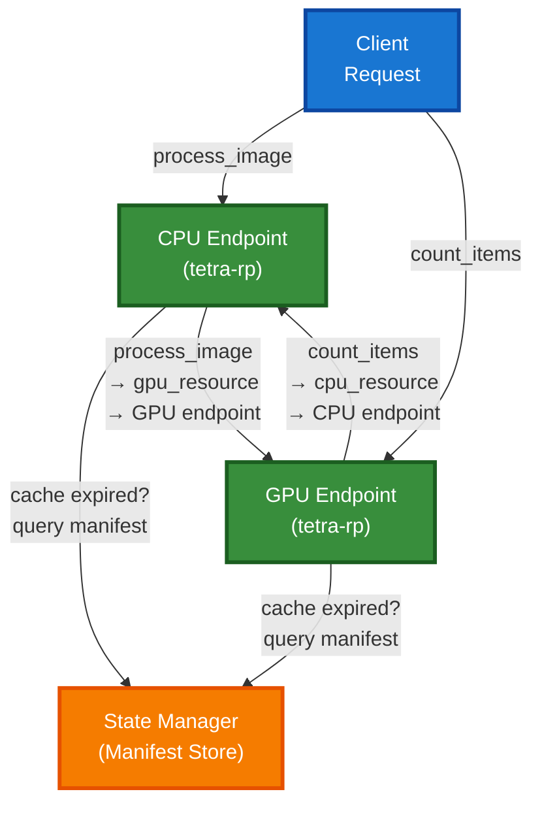
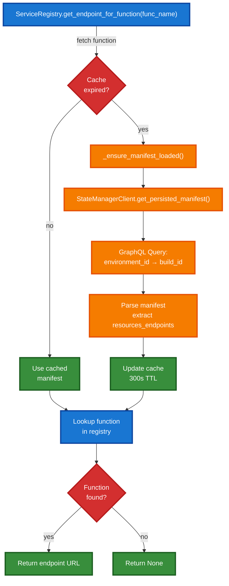
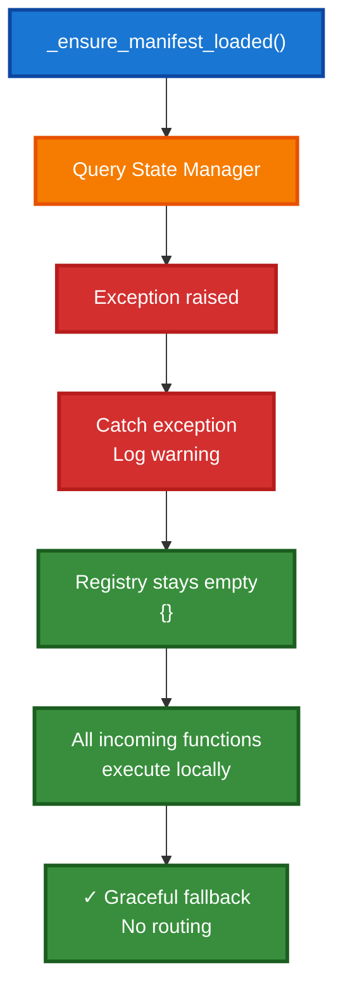
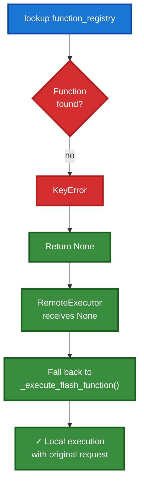

# Manifest Reconciliation with TTL-Based Caching

## Overview

Manifest reconciliation is the process of keeping the local endpoint's function registry synchronized with the State Manager. This enables cross-endpoint routing in Flash deployments where multiple resource types (CPU, GPU) handle different functions.

## Architecture

### Core Concept

Each endpoint maintains a cached copy of the complete function manifest that maps:
- **Function names** → Resource types (e.g., `process_image` → `gpu_resource`)
- **Resource types** → Endpoint URLs (e.g., `gpu_resource` → `https://api.runpod.io/v2/gpu-endpoint/run`)

This allows any endpoint to route incoming function calls to the appropriate resource without needing a central hub.



### TTL-Based Caching Strategy

Instead of querying State Manager on every function call, endpoints use **time-to-live (TTL) based caching**:

1. **Cache Miss (Fresh Start or Expired)**: Query State Manager for full manifest
2. **Cache Hit (Within TTL)**: Use cached manifest (default: 300 seconds)
3. **Cache Expiry**: TTL resets after next State Manager query

**Benefits:**
- Reduces State Manager query load by ~99% (1 query per 300s per endpoint vs 1 per function call)
- Minimizes latency impact on function routing
- Graceful fallback if State Manager is unavailable

### Thread Safety

Manifest reconciliation uses `asyncio.Lock` to protect concurrent access:

```python
async with self._endpoint_registry_lock:
    now = time.time()
    cache_age = now - self._endpoint_registry_loaded_at

    if cache_age > self.cache_ttl:
        # Refresh manifest atomically
        self._endpoint_registry = updated_registry
        self._endpoint_registry_loaded_at = now
```

This ensures only one coroutine queries State Manager at a time, preventing thundering herd when cache expires.

## Implementation Details

### File: `src/manifest_reconciliation.py`

The `ManifestReconciliationManager` handles:

1. **Manifest Loading** - Fetch from State Manager via StateManagerClient
2. **Cache Expiry Checks** - Compare current time against last_loaded timestamp
3. **Registry Updates** - Parse `resources_endpoints` mapping from manifest
4. **Error Handling** - Gracefully degrade if State Manager unavailable

### Integration Points

#### In `RemoteExecutor` (src/remote_executor.py)

When Flash mode is detected (no function code), routing uses ServiceRegistry:

```python
if not has_function_code and not has_class_code:
    # Flash deployment - use ServiceRegistry for routing
    endpoint_url = self.service_registry.get_endpoint_for_function(
        request.function_name
    )
    if endpoint_url:
        result = await self._route_to_endpoint(request, endpoint_url)
    else:
        result = await self._execute_flash_function(request)
```

#### In `ServiceRegistry` (tetra-rp)

The ServiceRegistry automatically calls `_ensure_manifest_loaded()`:

```python
async def _ensure_manifest_loaded(self) -> None:
    """Load manifest from State Manager if cache expired."""
    async with self._endpoint_registry_lock:
        now = time.time()
        cache_age = now - self._endpoint_registry_loaded_at

        if cache_age > self.cache_ttl:
            manifest = await self._manifest_client.get_persisted_manifest(
                os.getenv("RUNPOD_ENDPOINT_ID")
            )
            self._endpoint_registry = manifest.get("resources_endpoints", {})
            self._endpoint_registry_loaded_at = now
```

## State Manager Query Flow



## Manifest Structure

The State Manager returns manifests with this structure:

```python
{
    "function_registry": {
        "process_image": "gpu_resource",
        "count_items": "cpu_resource",
        "validate_data": "cpu_resource"
    },
    "resources_endpoints": {
        "gpu_resource": "https://api.runpod.io/v2/gpu-abc123/run",
        "cpu_resource": "https://api.runpod.io/v2/cpu-def456/run"
    }
}
```

This allows:
- **Local lookups**: O(1) function to resource mapping
- **Endpoint discovery**: O(1) resource to URL mapping
- **Graceful degradation**: If a resource is missing, function executes locally

## Configuration

### Environment Variables

- `RUNPOD_ENDPOINT_ID` - Identifies this endpoint to State Manager
- `RUNPOD_API_KEY` - Authenticates requests to State Manager
- `FLASH_RESOURCE_NAME` - (Optional) Override resource name for this endpoint

### Tuning

TTL can be configured via `ServiceRegistry` initialization:

```python
service_registry = ServiceRegistry(cache_ttl=600)  # 10 minutes instead of default 5
```

**Guidelines:**
- **Short TTL (60s)**: For rapidly changing deployments, higher State Manager load
- **Default TTL (300s)**: Balanced for typical deployments
- **Long TTL (900s+)**: For stable deployments with fewer changes

## Error Handling

### Scenario: State Manager Unavailable



### Scenario: Function Not in Manifest



## Testing

### Unit Tests

- `test_manifest_loading_with_ttl` - Verify cache expiry logic
- `test_concurrent_manifest_refresh` - Verify asyncio.Lock prevents thundering herd
- `test_state_manager_error_fallback` - Verify graceful degradation
- `test_endpoint_registry_parsing` - Verify `resources_endpoints` extraction

### Integration Tests

- Mock State Manager GraphQL responses
- Verify ServiceRegistry queries exactly once per TTL period
- Verify routing decisions made correctly based on manifest
- Verify local fallback on State Manager unavailability

## Observability

### Log Levels

- **DEBUG**: Manifest loading, cache hits/misses
- **WARNING**: State Manager unavailable, missing endpoints
- **ERROR**: Unexpected failures during manifest loading

Example logs:

```
DEBUG: Manifest loaded from State Manager: 3 endpoints, cache TTL 300s
DEBUG: Routing 'process_image' to https://api.runpod.io/v2/gpu-abc123/run
DEBUG: Cache hit for manifest (87 seconds old, TTL 300s)
WARNING: State Manager unavailable: Connection timeout. Cross-endpoint routing unavailable.
```

### Metrics (Future)

- State Manager query latency
- Cache hit rate (should be 99%+)
- Endpoints available per refresh
- Function execution routing decisions

## Design Rationale

### Why TTL-Based Instead of Event-Driven?

**TTL-Based (Current):**
- ✅ Simple, stateless design
- ✅ Automatic fallback when State Manager offline
- ✅ No dependency on event streaming infrastructure
- ✅ Reduces State Manager load by 99%

**Event-Driven Alternative:**
- ❌ Requires webhook/event streaming (more complex)
- ❌ State Manager must notify all endpoints of manifest changes
- ❌ More infrastructure to maintain
- ❌ Higher operational overhead

### Why Peer-to-Peer Instead of Hub-and-Spoke?

**Peer-to-Peer (Current):**
- ✅ All endpoints query State Manager directly
- ✅ No central Mothership endpoint
- ✅ Scales horizontally without coordinator
- ✅ Each endpoint independent

**Hub-and-Spoke Alternative (Rejected):**
- ❌ Requires Mothership endpoint
- ❌ Mothership becomes bottleneck
- ❌ Complex coordination logic
- ❌ Single point of failure

## Future Enhancements

1. **Dynamic TTL Tuning** - Adjust cache TTL based on manifest change frequency
2. **Manifest Versioning** - Detect manifest changes and prioritize hot reloads
3. **Metrics Collection** - Track State Manager query patterns
4. **Circuit Breaker** - Temporarily skip State Manager queries if it's consistently unavailable
