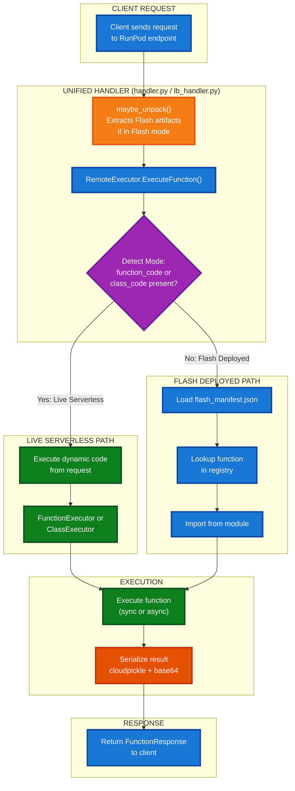

# Runtime Execution Paths

Worker-tetra now supports **dual-mode runtime** - the same handler can serve both Live Serverless and Flash Deployed Apps without code changes.

## Unified Handler Architecture

Both execution modes use the same `RemoteExecutor` with automatic mode detection:

- **Live Serverless**: Request includes `function_code` or `class_code` → Dynamic execution
- **Flash Deployed**: Request omits code fields → Manifest-based routing to pre-deployed code

## Execution Flow



## Deployment Mode Detection

The handler automatically detects the deployment mode using environment variables:

| Environment | RUNPOD_POD_ID | FLASH_* vars | Mode Detected |
|-------------|---------------|--------------|---------------|
| Local dev | ❌ Not set | ❌ Not set | Live Serverless only |
| Live Serverless | ✅ Set | ❌ Not set | Live Serverless |
| Flash Mothership | ✅ Set | ✅ FLASH_IS_MOTHERSHIP=true | Flash Deployed |
| Flash Child | ✅ Set | ✅ FLASH_MOTHERSHIP_ID, FLASH_RESOURCE_NAME | Flash Deployed |

Flash-specific environment variables:
- `FLASH_IS_MOTHERSHIP=true` - Set for mothership endpoints
- `FLASH_MOTHERSHIP_ID` - Set for child endpoints
- `FLASH_RESOURCE_NAME` - Specifies resource config name

## Request Format Differences

### Live Serverless Request
```json
{
  "function_name": "my_function",
  "function_code": "def my_function(): return 'result'",
  "args": [],
  "kwargs": {},
  "dependencies": ["requests"]
}
```

### Flash Deployed Request
```json
{
  "function_name": "my_function",
  "args": [],
  "kwargs": {}
}
```

Note: Flash requests omit `function_code` because code is pre-deployed.

## Shared Protocol

Both modes use identical serialization:
- **Arguments**: cloudpickle + base64 encoding
- **Results**: cloudpickle + base64 encoding
- **Deserialization**: Same SerializationUtils for both paths

## Key Files

- `src/handler.py` - RunPod Serverless handler
- `src/lb_handler.py` - Load Balancer (HTTP) handler
- `src/remote_executor.py` - Unified execution orchestrator with mode detection
- `src/unpack_volume.py` - Flash artifact extraction from shadow volumes
- `/app/flash_manifest.json` - Function registry for Flash deployments (created by flash build)