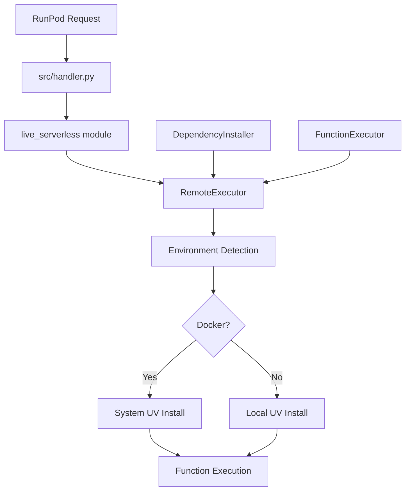
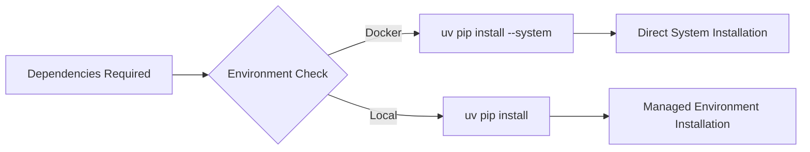
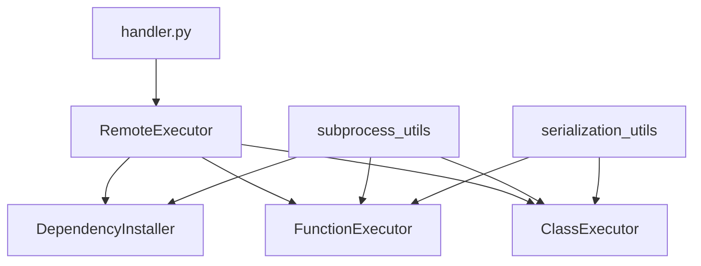

# System Python Runtime Architecture

## Overview

This design addresses full use of PyTorch installation built into the base Docker image that we use for the runtime.

**Module Structure**: The core implementation resides in the `src/live_serverless/` module. The `src/handler.py` file serves as a lightweight RunPod wrapper that imports and starts the handler from `live_serverless`.

## Architecture Design

### System Python Runtime



## Key Points


### Dependency Installation Strategy



### Component Architecture



## Benefits

### Improved Reliability
- **Environment detection** handles Docker vs local contexts
- **Centralized subprocess handling** through `run_logged_subprocess`
- **Consistent error handling** via `FunctionResponse` pattern

### Performance Optimizations
- **Faster cold starts** without venv initialization
- **Reduced container size** from simplified builds
- **Direct package access** eliminates the re-downloading torch and other built-in libraries

## Implementation Details

### System Installation Strategy
```python
# Docker environment
command = ["uv", "pip", "install", "--system"] + packages

# Local environment
command = ["uv", "pip", "install", "--python-preference=managed"] + packages
```

This architecture refactor addresses the core PyTorch installation issues while maintaining API compatibility and improving operational simplicity.
