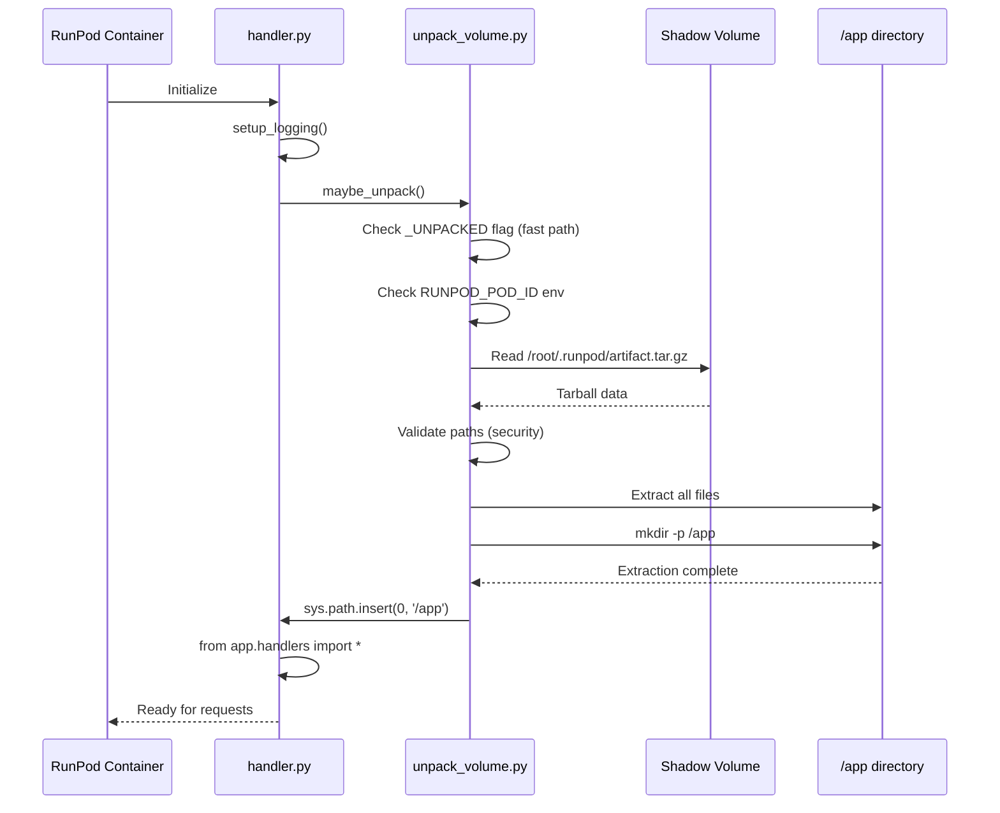

# Volume Unpacking System

## Overview

The volume unpacking system extracts pre-packaged application artifacts from persistent storage into the runtime environment. When a RunPod pod starts, the handler automatically detects and extracts `artifact.tar.gz` from `/root/.runpod/artifact.tar.gz` into `/app/`, making all code and dependencies immediately available for execution.

### Key Features

- **Automatic Extraction**: Triggered at handler initialization
- **Thread-Safe**: Multiple concurrent calls extract only once
- **Secure**: Path traversal prevention via `Path.is_relative_to()`
- **Environment-Aware**: Only runs in RunPod environments
- **Idempotent**: Safe to call multiple times

## Runtime Extraction Flow

### Sequence Diagram



## Key Components

| Component | Location | Responsibility |
|-----------|----------|----------------|
| Unpacking Entry | `src/unpack_volume.py:maybe_unpack()` | Orchestrates extraction |
| Extraction Logic | `src/unpack_volume.py:unpack_app_from_volume()` | Main extraction function |
| Security Validation | `src/unpack_volume.py:_safe_extract_tar()` | Path traversal prevention |
| Path Check | `Path.is_relative_to()` | Validates tar member paths |
| Configuration | `src/constants.py` | Default paths (artifact, app dir) |
| Handler Integration | `src/handler.py` | Calls maybe_unpack() at startup |

## Extraction Trigger

Runtime extraction is triggered automatically at handler initialization:

```python
# In src/handler.py
from unpack_volume import maybe_unpack

def handler(event):
    maybe_unpack()  # First call extracts, subsequent calls skip
    # ... handle request
```

## Extraction Implementation

### Double-Checked Locking Pattern

The `maybe_unpack()` function implements thread-safe extraction:

```python
def maybe_unpack():
    # 1. Fast path: Already unpacked?
    if _UNPACKED:
        return

    # 2. Environment check
    if not _should_unpack_from_volume():
        return  # Not in RunPod or disabled

    # 3. Thread-safe extraction
    with _UNPACK_LOCK:
        if _UNPACKED:  # Double-check
            return

        _UNPACKED = True
        logger.info("unpacking app from volume")

        # 4. Extract tarball
        unpack_app_from_volume()
```

**Source**: `src/unpack_volume.py:83`

### Security Features

Path traversal prevention using `Path.is_relative_to()`:

```python
def _safe_extract_tar(tar: tarfile.TarFile, target_dir: Path) -> None:
    target_dir_resolved = target_dir.resolve()

    for member in tar.getmembers():
        member_path = (target_dir / member.name).resolve()
        if not member_path.is_relative_to(target_dir_resolved):
            raise ValueError(f"unsafe tar member path: {member.name}")

    tar.extractall(path=target_dir)
```

**Attack Prevention Example**:

```python
# Malicious tar member: ../../../etc/passwd
member_path = Path("/app/../../../etc/passwd").resolve()
# → /etc/passwd

target_dir = Path("/app").resolve()
# → /app

if not member_path.is_relative_to(target_dir):
    raise ValueError("unsafe tar member path")
# ✅ Attack blocked!
```

**Source**: `src/unpack_volume.py:15`

### Thread Safety

Uses `threading.Lock` with double-checked locking pattern:

- **Fast path**: Check `_UNPACKED` flag without lock (most calls)
- **Slow path**: Acquire lock, check again, extract once
- **Guarantee**: Single extraction even with concurrent handler calls

**Source**: `src/unpack_volume.py:70-71`

### Environment Detection

Unpacking only occurs when running in RunPod environments:

```python
def _should_unpack_from_volume() -> bool:
    # Check 1: Is unpacking disabled?
    disable_value = os.getenv("FLASH_DISABLE_UNPACK", "").lower()
    if disable_value in {"1", "true", "yes"}:
        return False

    # Check 2: Are we in RunPod?
    if not (os.getenv("RUNPOD_POD_ID") or os.getenv("RUNPOD_ENDPOINT_ID")):
        return False

    return True
```

**Source**: `src/unpack_volume.py:74`

### sys.path Manipulation

After extraction, `/app` is added to Python's import path:

```python
app_dir_str = str(Path("/app"))
if app_dir_str not in sys.path:
    sys.path.insert(0, app_dir_str)  # Highest priority

# Now handlers can import:
from workers import my_function
from flash_manifest import load_manifest
```

**Source**: `src/unpack_volume.py:50`

## Configuration

### Environment Variables

| Variable | Purpose | Default | Example |
|----------|---------|---------|---------|
| `FLASH_BUILD_ARTIFACT_PATH` | Override artifact location | `/root/.runpod/artifact.tar.gz` | `/custom/path/artifact.tar.gz` |
| `FLASH_DISABLE_UNPACK` | Skip unpacking (testing) | `""` (enabled) | `true`, `1`, `yes` |
| `RUNPOD_POD_ID` | RunPod detection | Set by RunPod | `abc123` |
| `RUNPOD_ENDPOINT_ID` | Endpoint detection | Set by RunPod | `ep_xyz789` |

**Configuration Source**: `src/constants.py:28-36`

### Code Constants

```python
# src/constants.py
DEFAULT_APP_DIR = "/app"                                 # Extraction target
DEFAULT_ARTIFACT_PATH = "/root/.runpod/artifact.tar.gz"  # Default source
```

## Error Handling

### Exception Hierarchy

The extraction process uses specific exceptions for different error conditions:

| Exception | Condition | Source |
|-----------|-----------|--------|
| `FileNotFoundError` | Artifact not found at expected path | `unpack_volume.py:58` |
| `RuntimeError` | Extraction failed (corrupted tar, permissions) | `unpack_volume.py:64` |
| `ValueError` | Path traversal attempt detected | `unpack_volume.py:21` |

All errors are logged with full traceback before propagating:

```python
try:
    unpack_app_from_volume()
except (FileNotFoundError, RuntimeError) as e:
    logger.error("failed to unpack app from volume: %s", e, exc_info=True)
    raise RuntimeError(f"failed to unpack app from volume: {e}") from e
```

**Source**: `unpack_volume.py:104-108`

## Usage Examples

### Example 1: Verify Extraction (Inside Container)

```bash
$ ls -la /app/
total 1024
drwxr-xr-x 5 root root 4096 Jan 13 12:00 .
drwxr-xr-x 1 root root 4096 Jan 13 12:00 ..
-rw-r--r-- 1 root root 2048 Jan 13 12:00 flash_manifest.json
-rw-r--r-- 1 root root 4096 Jan 13 12:00 handler_gpu_config.py
drwxr-xr-x 3 root root 4096 Jan 13 12:00 workers/
drwxr-xr-x 120 root root 4096 Jan 13 12:00 site-packages/

$ python -c "import sys; print('/app' in sys.path)"
True  # ✅ Unpacking added /app to sys.path
```

### Example 2: Custom Artifact Path

```bash
# Set environment variable before container starts
export FLASH_BUILD_ARTIFACT_PATH=/mnt/custom/my-artifact.tar.gz
# Handler will extract from custom location
```

### Example 3: Disable Unpacking (Testing)

```bash
export FLASH_DISABLE_UNPACK=true
# Useful for local testing without artifacts
```

### Example 4: Debugging Extraction

```python
# Enable verbose logging
import logging
logging.basicConfig(level=logging.DEBUG)

from unpack_volume import maybe_unpack
maybe_unpack()

# Output:
# DEBUG:unpack_volume:Checking if unpacking should occur...
# INFO:unpack_volume:unpacking app from volume
# DEBUG:unpack_volume:Extracting /root/.runpod/artifact.tar.gz
# DEBUG:unpack_volume:Validating 127 tar members...
# INFO:unpack_volume:successfully extracted build artifact to /app
```

## Performance Characteristics

- **Time Complexity**: O(n) where n = number of files in tarball
- **Space Complexity**: O(1) streaming extraction (no intermediate buffering)
- **Blocking Behavior**: Yes, blocks handler initialization until extraction completes
- **Typical Duration**: 50-200ms for small tarballs (<10MB), 500ms-2s for large tarballs (>100MB)
- **Thread Safety**: Minimal locking overhead due to double-checked locking pattern
- **Memory Usage**: Minimal, tarfile streams data directly to disk

## Testing Coverage

The volume unpacking system has comprehensive test coverage:

- **Unit Tests**: 25 tests covering all functions in `unpack_volume.py`
- **Integration Tests**: 3 end-to-end scenarios with real tarball extraction
- **Coverage**: 98% for `unpack_volume.py` module
- **Test Locations**:
  - Unit tests: `tests/unit/test_unpack_volume.py`
  - Integration tests: `tests/integration/test_unpack_volume_integration.py`

### Test Categories

1. **Path Traversal Prevention**: Validates security against malicious tar members
2. **Thread Safety**: Tests concurrent extraction attempts
3. **Environment Detection**: Validates RunPod environment checks
4. **Idempotency**: Ensures single extraction with multiple calls
5. **Error Handling**: Tests missing artifacts, corrupted tarballs, permission issues
6. **Large Tarballs**: Tests extraction of 50+ files across multiple directories

## Future Enhancements

Tracked improvements for future releases:

- **Extraction Limits**: Size/count limits to prevent tar bombs
- **Cleanup on Failure**: Remove partial extractions if errors occur
- **Structure Documentation**: Document expected artifact structure
- **Observability**: Add metrics/timing for extraction performance
- **Compression Options**: Support for additional compression formats (zstd, xz)
